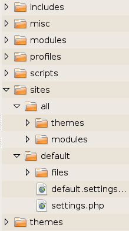

# Formation Administration Drupal 7

--------------------------------------------------------------------------------

# Objectifs de la formation

  * Les CMS et Drupal
  * L'architecture de Drupal
  * Les contrôles d'accès
  * La gestion du contenu
  * L'organisation du contenu
  * Les thèmes
  * Les fonctionnalités avancées

--------------------------------------------------------------------------------

# Les CMS et Drupal

--------------------------------------------------------------------------------

## Historique

  * Sites statiques en HTML, création page par page
    * fastidieux à maintenir
  * Sites dynamiques, Framework proposant des API
    * briques de base pour le code, standardisation
    * beaucoup de développement
  * CMS : Système de gestion de contenu
    * briques de fonctionnalités
    * pas/peu de développement

--------------------------------------------------------------------------------

## Quelques autres CMS

  * Wordpress
    * grande communauté
    * nombreux plugins et thèmes
    * qualité/sécurité du code laisse à désirer hors du cœur
    * pratique pour les projets statiques/légers

![][19]

--------------------------------------------------------------------------------

## Quelques autres CMS

  * Joomla
    * plugins nombreux mais peu maintenus
    * communauté moindre

![][20]

--------------------------------------------------------------------------------

## Définitions

> Content Management Framework

## Drupal = CMS + framework

  * environ 9500 modules disponibles pour Drupal 7
  * communauté active ([http://drupal.org][1] & [http://drupalfr.org][2])
  * popularité et renommée grandissante

![][21]

--------------------------------------------------------------------------------

## Quelques références mondiales

  * Tesla
  * Washington Post
  * Twitter Documentation
  * Economist.com
  * Harvard community
  * Stanford school
  * Grammy.com
  * Amnesty.org
  * LinkedIn developer documentation
  * Nvidia developer documentation
  * Danone

--------------------------------------------------------------------------------

## Quelques références françaises

  * Guerlain
  * McDonalds
  * Cartier
  * Symfony
  * Parti socialiste / UMP
  * Gouvernement.fr / Senat.fr / Sites des minstères
  * Eurostar
  * Orange Business Services
  * Rue89
  * Mediapart

--------------------------------------------------------------------------------

## Installation

  * Pré-requis
    * Environnement Apache/MySQL/PHP
      * Windows : EasyPHP/Xampp/Wamp
      * Linux : LAMP
  * Alternatives : Microsoft IIS, PostgreSQL, SQLite
  * Versions :
      * Apache 1.3 ou 2.x
      * MySQL > 5.0.15
      * PHP > 5.3
  * Clean URL : mod_rewrite
    * [http://drupal.org/requirements][3]

--------------------------------------------------------------------------------

## Installation

  * Créer une base de données vide
  * Décompresser l'archive Drupal dans le répertoire du serveur
  * Accéder à l'application via un navigateur
  * Dérouler le processus d'installation :
    * Connexion à la base de données
    * Paramètrage du site et du compte admin
    * Création et accès au site
    * Visiter Administrer > Rapports > Tableau de bord

--------------------------------------------------------------------------------

## Exercice

  * Via PhpMyAdmin, créer une base de données vide
  * Décompresser l'archive Drupal dans le répertoire pré-configuré du serveur
  * Accéder à l'application via un navigateur
  * Dérouler le processus d'installation

![][22]

(Télécharger Drupal 7 : 
[https://www.drupal.org/project/drupal](https://www.drupal.org/project/drupal))

.fx: alternate

--------------------------------------------------------------------------------

# L'architecture de Drupal

--------------------------------------------------------------------------------

## Arborescence des fichiers

<!-- WARNING: this slide uses CSS, see css/admin-drupal.css -->

Modules intégrés au cœur de Drupal

Thèmes spécifiques au site

Modules spécifiques au site

Répertoire d'upload par défaut

Fichier de configuration

Thèmes intégrés au cœur de Drupal

.fx: file-tree

--------------------------------------------------------------------------------

## Principales fonctionnalités - Modules du core

  * _System, User_ → prérequis
  * _Node, Field, Comment, File, Image_ → création de contenu
  * _Text, List, Options, Number_ → types de champ
  * _Menu, Block, Taxonomie_ → structuration
  * _Toolbar, Shortcut, Dashboard, Color, Overlay, Contextual_ → personnalisation de l'interface
  * _Book, Blog, Forum, Poll_ → types de contenu avancés
  * _Contact, Aggregator, Tracker, Update, OpenID_ → fonctionnalités spécifiques
  * _Path, RDF_ → SEO
  * _Locale, Content Translation_ → traduction

> Sans ses modules « contrib », Drupal ne permet que de créer des sites simples.

--------------------------------------------------------------------------------

## Choix des modules

  * Choisir le module : [http://drupal.org/project/modules][5]
  * Version courante (alpha, beta, dev, stable)
  * Utilisation
    * Versions D4.7, D5, D6, D7
    * Module peu/très utilisé
  * Intégration avec d'autres modules
    * Intégration future facilitée
  * Incompatibilité avec des modules
  * Nombre de bugs ouverts
    * Vitesse de traitement des bugs

> [http://simplytest.me](http://simplytest.me) pour tester le core ou ses modules rapidement

--------------------------------------------------------------------------------

## Versions des modules

<!-- WARNING: this slide uses CSS, see css/admin-drupal.css -->

  * Exemple avec « 7.x-2.1 »
    * __7.x__-2.1 : Pour Drupal 7
    * 7.x-__2__.1 : Version majeure du module 
       → Changement d'API par rapport à la 1.x
    * 7.x-2.__1__ : Version mineure du module 
       → Bug fixing par rapport à la 2.0
  * 4 dénominations essentielles
    * Dev : module en développement
    * Alpha : module utilisable, API non figée
    * Beta : API en cours de gel
    * RC : tests finaux avant version stable

.fx: module-versions

--------------------------------------------------------------------------------

## Installation de modules

  * Méthode :
    * Décompresser l'archive du module dans /sites/all/modules
    * Utiliser l'interface d'installation
    
![][6]

  * Lire le README.txt et le INSTALL.txt
  * Activer et configurer
    * Paramètres
    * Droits d'accès

![][7]

--------------------------------------------------------------------------------

## Architecture des interfaces

  * Structure du menu d'administration
  * Raccourcis (module _Shortcut_)
    * Créer des raccourcis / user

![][8]

--------------------------------------------------------------------------------

## Exercice

<!--
  Sans le module Workbench, les vues offertes par Workbench Moderation ne sont
  pas accessibles via le menu d'administration. Les rôles « modérateurs » n'ont
  donc aucun moyen de voir les contenus non publiés en attente d'approbation.
  
  On active donc Workbench pour disposer des vues « My drafts » et « Needs
  review » et ainsi ne pas amener les stagiaires à modifier ces vues ou à user
  de la permission « Bypass content access control ».
-->

  * Installer les modules _Workbench_, _Workbench Moderation_, _Views_
    et _WYSIWYG_
  * Configurer le module _WYSIWYG_
    * Librairies TinyMCE, FCK Editor ou CKEditor
  * Configuration > Formats de texte
  * Configuration > Profils WYSIWYG

.fx: alternate

--------------------------------------------------------------------------------

# Les contrôles d'accès

--------------------------------------------------------------------------------

## Gérer les utilisateurs

  * Paramétrage des comptes utilisateurs
    * Configuration > Personnes > Paramètres de compte
    * Méthodes d'inscription/désinscription
    * Personnalisation des e-mails
    * Ajout de champs sur les utilisateurs
    * ...
  * Liste des utilisateurs
    * Personnes
    * Filtres par rôles/droits d'accès/statut
    * Actions de masse

--------------------------------------------------------------------------------

## Droits d'accès

  * Ensemble de droits gérés par l'administrateur
    * Personnes > Droits
    * Personnes > Droits > Rôles

![][9]

--------------------------------------------------------------------------------

## Workflow

  * _Workbench Moderation_
    * Paramétrage des droits
    * Gestion de la publication et des révisions

![][10]

![][11]

--------------------------------------------------------------------------------

## Exercice

  * Créer un rôle « Modérateur »
  * Créer un rôle « Rédacteur »
  * Créer 2 utilisateurs et leur attribuer chacun un rôle
  * Paramétrer les droits d'accès pour ces rôles :
    * le rédacteur peut créer/éditer des pages uniquement
    * le modérateur peut modérer ces pages
  * Tester le workflow :
    * Créer une page en tant que rédacteur
    * Accéder à la page « Needs review » en tant que modérateur
      (My Workbench > Needs review)
    * Publier la page

.fx: alternate

--------------------------------------------------------------------------------

## Pour aller plus loin...

  * _Content Access_ / _ACL_ / _Simple Access_
    * Accès par rôle ou par utilisateur à un contenu

  * _Workbench Access_
    * Accès par rôle ou par utilisateur à une rubrique

  * _Maestro_

  * Reconstruction des droits d'accès

--------------------------------------------------------------------------------

# La gestion du contenu

--------------------------------------------------------------------------------

## Les types de contenu

  * Article / Page... Actualité / Partenaire...
  * Créés
    * Manuellement
    * Par des modules
  * Paramètres
    * Réglages des commentaires
    * Options de publication (Publié, Épinglé, Promu en page d'accueil)
    * Libellé du titre
  * ...

--------------------------------------------------------------------------------

## Les types de contenu

  * Gestion des champs
    * Paramètres d'affichage des champs
    * Gestion des droits (module _Field Permissions_)

  * Gestion des images (définition de styles)

  * Modules complémentaires :
    * Modules _Date_, _References_, etc
    * Module _WYSIWYG_

  * Création de nœuds (nodes)

--------------------------------------------------------------------------------

## Création de contenu

  * Contenu > Créer un contenu

  * Formulaire d'édition
    * Édition des champs
    * Paramètrage du menu : ajout d'un élément de menu
    * Révisions
    * Informations et options de publication

--------------------------------------------------------------------------------

## La gestion du contenu

![][12]

  * Liste des contenus (nœuds)
    * Filtres par statut/type de contenu/langue
    * Actions de masse

--------------------------------------------------------------------------------

## Les modes d'affichage

  * Définissent si un champ doit apparaitre et comment il doit apparaitre
    (via un de ses formatters)
  * Les modes d'affichage sont fournis par les modules
  * Modes natifs du cœur Drupal :
    * _Par défaut_
    * Contenu complet (Full)
    * Accroche (Teaser)
    * RSS
    * Résultat de recherche (Search index)

> Si le mode d'affichage n'est pas défini pour un type de contenu, celui par
défaut sera pris en compte.

--------------------------------------------------------------------------------

## Exercice

  * Créer un type de contenu « Livre »
  * Activer les commentaires
  * Champs :
    * Titre
    * Référence (texte)
    * Auteur (texte) 
    * Résumé (texte long)
    * Couverture (image)
  * Masquer la référence à l'affichage du contenu en mode
    «&nbsp;Contenu complet » et « Accroche »
  * Afficher le libellé du champ « Auteur » sur la même ligne que la valeur
  * Créer au moins deux livres

.fx: alternate

--------------------------------------------------------------------------------

## Panels

.notes: _Panels_ n'est pas un module du cœur.

  * Permet de structurer les nœuds et les contenus entre eux
  * En fonction de condition
  * Interface complexe
  * Peut vite devenir une « usine à gaz »
  * Préférable de ne pas penser à _Panels_ tout de suite

![][23]

--------------------------------------------------------------------------------

## Display suite

  * Structurer les champs à l'affichage des nœuds
  * Créer de nouveaux modes d'affichage

![][24]

--------------------------------------------------------------------------------

## Exercice

  * Créer 2 nouveaux « displays » pour les livres :
    * 2 colonnes avec :
     - la couverture à gauche
     - le reste à droite
    * 2 colonnes avec :
     - le corps de texte (body) à droite
     - le reste à gauche

.fx: alternate

--------------------------------------------------------------------------------

# L'organisation du contenu

--------------------------------------------------------------------------------

## Les menus - Introduction

  * Menus par défaut
    * Menu principal
    * Menu utilisateur
    * Navigation
    * Management
  * Possibilité de créer ses propres menus
  * Création automatique d'un bloc pour chaque menu

![][13]

--------------------------------------------------------------------------------

## Les menus - En détails

  * Création d'un élément de menu
    * Via l'administration des menus
    * À la création d'un nœud
  * Possibilité de désactiver les éléments de menu
  * Possibilité de hiérarchiser les éléments de menu
  * Création de séparateurs ou d'éléments sans lien → _Special Menu Items_
  * Création de menus basés sur les taxonomies → _Taxonomy Menu_

    
> Les éléments de menu sont affichés à l'utilisateur seulement s'il a la
permission d'accéder à la cible.

--------------------------------------------------------------------------------

## Exercice

  * Installer le module _Nice menus_
  * Ajouter quelques liens externes et internes
  * Organiser entre parents et enfants

.fx: alternate

--------------------------------------------------------------------------------

## La taxonomie - Introduction

  * Catégorisation du contenu
    * Notion de vocabulaire
    * Termes de taxonomie

![][25]

  * Lister les contenus associés à un terme
    (chaque terme possède sa propre page)
  * Un type de contenu peut utiliser plusieurs vocabulaires et inversement

> Ne pas dépasser une dizaine de vocabulaires, ni une centaine de termes pour
chacun d'eux.

--------------------------------------------------------------------------------

## La taxonomie - Comment ça marche ?

  * Utilisation des champs de type « Term reference » pour associer les contenus
    aux termes
  * 2 modes d'association aux termes :
    * sélection simple dans une liste (selection widget)
    * sélection par autocomplétion avec création de termes à la volée (tagging widget)
  * Un même champ peut exposer plusieurs vocabulaires

![][26]

--------------------------------------------------------------------------------

## Exercice

  * Créer un vocabulaire « Genre » et lui ajouter quelques termes (« Science
    Fiction », « Fantastique », « Policier », ...)
  * L'appliquer au type de contenu « Livre » et catégoriser les livres créés
    précédemment
  * Créer un élément de menu (menu principal) pour chaque terme créé
  * Créer un bloc « À la une » affichant le descriptif d'un livre
  * Afficher ce bloc uniquement sur la page d'accueil en barre latérale droite

.fx: alternate

--------------------------------------------------------------------------------

## La gestion des blocs

  * Un thème se décompose en régions
  * Structure > Blocs
    * Choix du thème à configurer
    * Positionnement des blocs
  * Attribution à une région via la liste de sélection
  * Ordonnancement à l'aide du glisser/déposer

![][14]

> Un bloc ne peut être associé qu'à une seule région.

--------------------------------------------------------------------------------

## La gestion des blocs

  * Création des blocs :
    * Par des modules
    * Manuelle via la fonctionnalité par défaut
    * Manuelle via _Views_
  * Affichage des blocs en fonction :
    * du rôle de l'utilisateur
    * du type de contenu
    * de l'URL

![][16]

--------------------------------------------------------------------------------

## Exercice

  * Placer un « nice menu » du menu principal :
    * en sidebar
    * pour toutes les pages sauf la page d'accueil
  * Afficher qui est connecté :
    * en footer
    * pour les utilisateurs connectés
  * Afficher le bloc RSS :
    * en fin de contenu
    * pour tous les contenus

.fx: alternate

--------------------------------------------------------------------------------

## Les vues - Introduction

  * Listing de contenus

  * 2 étapes :
    * Récupération et filtrage des données
    * Choix du plugin d'affichage

  * Permet de créer blocs, pages, flux RSS, fichiers Excel, données JSON,
    cartes, etc

  * Les modules peuvent fournir des vues par défaut (ex. : _Administration Views_)

--------------------------------------------------------------------------------

## Les vues - Aperçu

  * Interface simplifiée
  
![][17]

--------------------------------------------------------------------------------

## Les vues - En détails

  * Champs
    * Données à afficher
  * Filtrage des données
    * Type de contenu, taxonomie, etc.
  * Filtres exposés
  * Ordre de tri
    * Date de publication, titre, etc.
  * Relations entre « entités » (jointure SQL)
  * Filtres contextuels
    * Ajout d'un filtre dynamique dans l'URL

--------------------------------------------------------------------------------

## Les vues - En détails

  * Gestion de l'affichage
    * Style = mise en forme
  * Style de ligne = Données à afficher
  * Nombre d'éléments à afficher
  * Pagination
  * Messages d'entête/pied de page/texte de page vide
  * Modes d'affichage
    * Page
    * Bloc
    * Flux RSS
    * « Fichier attaché »
    * ...

--------------------------------------------------------------------------------

## Exercice

  * Vue de type bloc :
    * Ajouter une case à cocher « Mettre à la une » au type de contenu « Livre »
    * Pour un des livres enregistrés, cocher cette case
    * Créer un bloc affichant le livre dont la case « Mettre à la une » est
      cochée
    * Afficher ce bloc sur toutes les pages du site

  * Vue de type page :
    * Créer une vue permettant de lister les livres sous forme de tableau
    * Afficher les données suivantes :
       - Titre
       - Auteur
       - Genre
       - Liens de visualisation, d'édition et de suppression
    * Trier par titre et exposer un filtre par genre
    * Créer un menu « Tous les livres » vers cette page

.fx: alternate

--------------------------------------------------------------------------------

# Les thèmes

--------------------------------------------------------------------------------

## Introduction

  * Habillage graphique front-office et back-office
    * [http://drupal.org/project/themes][18]
  * À placer dans sites/all/themes
  * Paramétrage différent selon le thème
  * Possible intégration avec le module _Color_
  * Chaque thème ajoute son propre CSS à celui des modules et surcharge les
    templates par défaut des modules grâce aux suggestions

--------------------------------------------------------------------------------

## Création d'un thème

  * Utiliser un « starter » thème
    * Omega
    * Zen
    * Mothership
    * Genesis
    * Stark
  * Gain de temps
  * Classes CSS préexistantes
  * Documentation
  * Réutilisabilité

--------------------------------------------------------------------------------

## Les templates

  * page.tpl.php, node.tpl.php, block.tpl.php
  * page-front.tpl.php, node-story.tpl.php, node-18.tpl.php
  * views-views--&lt;nom de la vue&gt;.tpl.php
  * views-view-field--&lt;nom du champ&gt;.tpl.php

## Exercice

  * Installer le thème Rubik

--------------------------------------------------------------------------------

## Exercice récapitulatif

  * Créer un type de contenu « Auteur » :
    * Nom
    * Présentation
    * Photo
  * Ajouter une référence (_References_) vers l'auteur au type de contenu « Livre »
  * Faire une vue bloc qui affiche la bibliographie de l'auteur en sidebar des
    pages livre
  * Faire une vue page qui affiche un slideshow (_Views Slideshow_) des 5
    derniers livres publiés
    * Mettre un message de bienvenue en entête
    * Définir cette page comme page d'accueil
  * Faire une vue de recherche des livres

.fx: alternate

--------------------------------------------------------------------------------

# Les fonctionnalités avancées

   [1]: http://drupal.org/

   [2]: http://drupalfr.org/

   [3]: http://drupal.org/requirements

   [4]: img/archi_fichiers.png

   [5]: http://drupal.org/project/modules

   [6]: img/navigation.png

   [7]: img/modules.png

   [8]: img/raccourcis.png

   [9]: img/permissions.png

   [10]: img/workbench.png

   [11]: img/revisions.png

   [12]: img/contenu.png

   [13]: img/menu.png

   [14]: img/regions.png

   [15]: img/block.png

   [16]: img/visibilite.png

   [17]: img/views.png

   [18]: http://drupal.org/project/themes

   [19]: img/wordpress-logo.png

   [20]: img/joomla-logo.png

   [21]: img/druplicon-logo.png

   [22]: img/installed.png

   [23]: img/panels.png

   [24]: img/ds.jpg

   [25]: img/taxonomy.png

   [26]: img/taxonomy_field.png

