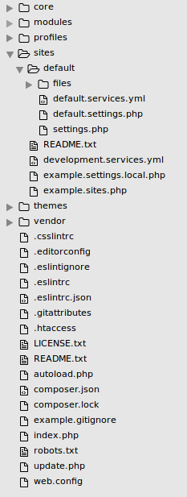
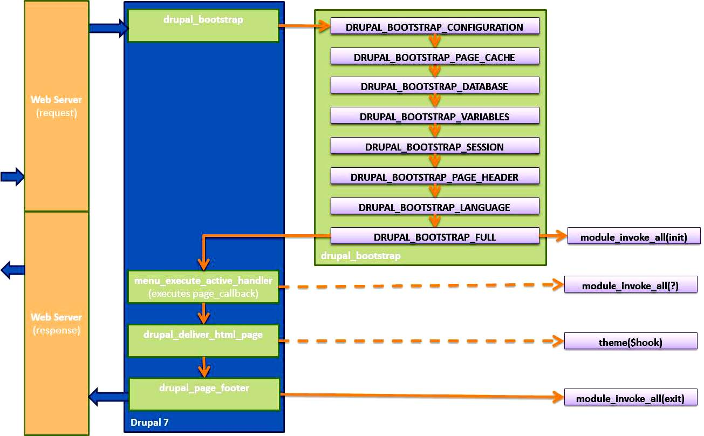

# Formation Développement Drupal

.fx: larger

--------------------------------------------------------------------------------

# Objectifs de la formation
  * Appréhender l'environnement de développement Drupal
  * Comprendre les concepts et l'API Drupal 
  * Modifier le comportement d'un module existant 
  * Créer un module
  * Créer un profil d'installation
# Prérequis
  * Connaitre PHP et avoir développé quelques scripts
  * Avoir construit un site avec Drupal
  * Notions de HTML, CSS, JavaScript et requêtes SQL

--------------------------------------------------------------------------------

# 1er jour
  * Rappels PHP
  * Environnement de développement
  * Quelques outils utiles (Drush, Git, Devel)
  * Bonnes pratiques, standards de code, documentation
  * Architecture de Drupal
  * Les concepts de base
  * Création du squelette d'un module
  * Les premiers hooks
# 2ème jour
  * Les différentes API
  * Les nœuds, le contenu et les droits d'accès
  * L'alteration des modules

--------------------------------------------------------------------------------

# 3ème jour
  * La form API
  * Les mails
  * Créer un thème basique
  * Les profils d'installation

 
 
 

# Slides disponibles en ligne

# <http://makinacorpus.github.io/makina-slides/drupal8-dev.html>

--------------------------------------------------------------------------------

# Rappels PHP

 <https://www.drupal.org/getting-started-d8-bkg-prereq> 

.fx: alternate

--------------------------------------------------------------------------------

# Les normes PHP

  * Viennent du PHP Framework Interoperability Group (FIG)
  * Différentes normes
    * PSR-0 : autoloader standard
    * PSR-1 : normes de codage de base (Drupal les suit presque)
    * PSR-2 : normes de codage plus poussées (Drupal les suit presque)
    * PSR-3 : interface du logger (pas implémentée dans Drupal)
    * PSR-4 : autoloader amélioré (choisi par Drupal) : https://www.drupal.org/node/2156625

--------------------------------------------------------------------------------

# Symfony (<http://symfony.com/>)

  * Le plus populaire des frameworks PHP aujourd'hui
  * Ensemble de composants réutilisables
  * Certains sont réutilisés par Drupal
    * <http://symfony.com/projects/drupal>

--------------------------------------------------------------------------------

# YAML

  * Fichier texte
  * 'key: value'

--------------------------------------------------------------------------------

# Composer (<https://getcomposer.org>)

  * Gestionnaire de dépendances utilisé par la communauté PHP
  * Installation uniquement locale au projet
  * composer.json
  * "composer install"
  * composer.lock
  * Contient un autoloader

<pre><code>
  curl -sS https://getcomposer.org/installer | php
  mv composer.phar /usr/local/bin/composer
</code></pre>

  <https://bojanz.wordpress.com/2015/09/18/d8-composer-definitive-intro/>

--------------------------------------------------------------------------------

# Environnement de développement

.fx: alternate

--------------------------------------------------------------------------------

# Le serveur Web

  * xAMP (Apache, MySQL, PHP) conseillé
  * D'autres possibilités : Nginx / IIS, PostgreSQL
  * Liste des languages utilisés :
    * SQL
    * PHP
    * Javascript
    * HTML
    * CSS

On utilisera dans cette formation Acquia Dev Desktop qui permet d'installer un
environnement de développement avec tous les pré-requis Drupal.

.notes: faire un tour de table des compétences et de l'expérience PHP, présenter Acquia, Dries et pourquoi AcquiaDevDesktop est pratique

--------------------------------------------------------------------------------

# TP: Installer Drupal 7

  * Choisir la distribution Drupal 7.x simple dans Acquia Dev Desktop
  * Installer le profil d'installation Standard
  * Paramètres
    * Nom du site : Formation
    * Adresse de courriel : formation@example.org
    * Utilisateur : admin
    * Mot de passe : admin
  * Désactiver les modules
    * update
    * shortcut
    * color

.fx: tp
.notes: présenter les distributions

--------------------------------------------------------------------------------

# L'éditeur de code

  * Le meilleur est celui que vous maitrisez
  * Différence IDE/Editeur simple :
    * Autocomplétion
    * XDebug
    * Refactoring
    * Erreurs de syntaxe
  * Possibilité de télécharger des configurations
  * Exemples
    * PHPStorm
    * Eclipse
    * Netbeans
    * Atom
    * Vim

--------------------------------------------------------------------------------

# Les standards de codage*

  * Indentation, espaces : lisibilité du code
  * Nommage, toujours commencer par le nom système : éviter les conflits
    * fonctions
    * constantes
    * variables persistantes
    * classes
    * fichiers
  * Tags `<?php` non fermés : éviter l'envoi du buffer

<strong>A connaître pour comprendre et être compris</strong>

# <https://drupal.org/coding-standards>

\* <small>basés sur le standard PEAR</small>

--------------------------------------------------------------------------------

# TP: Configuration de PHPStorm
  * Ouvrir le dossier Drupal dans PHPStorm
  * Afficher les messages de journal de PHPStorm
  * Cliquer sur "Enable Drupal support" et configurer le chemin
  * Cliquer sur "Fix extensions"

Avantages :

  * code style implémenté
  * navigation dans les hooks (appels et déclarations)
  * installation d'XDebug facile

.fx: tp

--------------------------------------------------------------------------------

# Les modules Drupal utiles au développement
  * _Features_: transférer la configuration dans le code
  * _Devel_ : debug et informations sur les données
  * _Drupal Console_ : générateur de code
  * _Drush_ : administration (DRUpal SHell)
  * _Drush Make_ : téléchargement de modules et librairies
  * _Coder_ : revue de code
  * _Masquerade_ : changer d'utilisateur sans se déconnecter
  * _Examples for developpers_ : démonstrations de l'utilisation de l'API

--------------------------------------------------------------------------------

# TP: Drush
  * Lancer Drush 
  * Regarder la liste des commandes 
  * Installer un module (features) 
  * Regarder à nouveau la liste des commandes 
  * Sauvegarder la base de données 
  * Installer les modules utiles au développement : devel, masquerade, examples
  * Desactiver le module help

.fx: tp

--------------------------------------------------------------------------------

# Git et la gestion de versions

  * Utilisé par beaucoup de développeurs dans le milieu du web

  * Très utile pour patcher des modules car utilisé pas la communauté Drupal et
  sur drupal.org

  * Une connaissance basique de quelques commandes suffit

    * git clone
    * git add
    * git commit
    * git diff

  * Possibilité d'avoir une interface graphique : SourceTree, GitX, GitEye, Github

--------------------------------------------------------------------------------

# L'architecture de Drupal

.fx: alternate

--------------------------------------------------------------------------------

# Présentation de l'arborescence

Cœur de Drupal 
Modules de tous les sites 
Profils d'installations 
Répertoire spécifique au site 
Répertoire d'upload par défaut 
Fichiers de configuration 
- 
- 
- 
- 
- 
Thèmes de tous les sites 

  
Où travailler ? Dans un profil d'installation custom ou dans un
sous-repertoire `custom`

## <u>/!\</u> Le hack du core et l'avenir des chatons

--------------------------------------------------------------------------------

--------------------------------------------------------------------------------

# Les librairies JS

  * jQuery
  * jQuery UI
  * Backbone
  * Underscore

--------------------------------------------------------------------------------

#TP: Jetons un œil à la base de données

  * se familiariser avec PhpMyAdmin

  * identifier les tables des modules actuellement activés

  * identifier les autres : cache, variable, registry

  * identifier la table contenant la configuration

.fx: tp

--------------------------------------------------------------------------------

# Qu'est ce qu'un module ?
  * `.info.yml` (<https://www.drupal.org/node/2000204>)
    * `name`
    * `core`
    * `description`
  * `.module` (souvent vide en D8)
  * `.install` facultatif (configuration indépendante)
  * les fichiers `.test` facultatif
  * les fichiers `.inc` facultatif
  * répertoire "config/install" pour la configuration

--------------------------------------------------------------------------------

# Fil rouge : le module gold, une fonctionnalité Premium

  * Créer deux permissions pour les rôles, une pouvant affecter le status gold
  aux contenus et l'autre le voir
  * Créer un bloc affichant si l'utilisateur a la permission de voir les
  contenus gold
  * Administrer les types de contenus concernés par le statut gold
  * Altérer le formulaire d'édition de nœud pour ajouter le statut gold
  * Envoyer un mail aux utilisateurs ayant la permission de voir les contenus
  gold lorsque qu'un nouveau contenu gold apparait sur le site
  * Lister les contenus avec le statut gold
  * Créer un style d'image pour illustrer les contenus gold
  * Créer une fonction de theme pour afficher le statut gold d'un nœud
  * Créer des tests pour vérifier le bon fonctionnement du module

Créer ce module : il doit apparaître dans la liste des modules.

.fx: tp

--------------------------------------------------------------------------------

# La création d'un module

.fx: alternate

--------------------------------------------------------------------------------

# Avant de commencer

## Votre bible : api.drupal.org

  Recense toutes les fonctions de Drupal, et leur documentation. Un IDE aura
  cette même documentation dans le code.

  Aborde certains topics en profondeur : form API, schema API, hooks, etc

 
## Votre guide : modules `examples`

  Pour chaque concept de Drupal, des exemples concrets d'utilisation (ajax, form,
  blocks, cache, render, cron, dbtng, email, menu, node_access, theming, ...).

  Ils sont fonctionnels : on peut les activer et voir leur impact en terme
  d'interface.

  Très bien documentés, ne pas hésiter à lire, comprendre et reprendre le code
  de ces modules.

--------------------------------------------------------------------------------

# Les hooks 

  * Implémenter `hook_form_alter()` donnera `mon_module_form_alter()`

  * Poids des modules et altération
  * Répondent à des déclencheurs
  * Des hooks peuvent être déclarés par des modules contrib
  * Rappel: on ne « hack » JAMAIS le code <small>(sauf en cas de module bogué)</small>
  * 3 types de hooks : déclaratif, évenementiel, d'altération
  * Les implémentations sont mise en cache
  * Les hooks déclaratifs sont généralement mis en cache

Liste des hooks <https://api.drupal.org/api/drupal/core!core.api.php/group/hooks/8>

BEAUCOUP de hooks disponibles dans le cœur de Drupal
En Drupal 8, des hooks ont été transformés (en plugin, en fichier .yml, ...)

--------------------------------------------------------------------------------

# Les permissions

  * Créer un fichier `.permissions.yml`

  * Créer les deux permissions

  * Vider le cache

  * Créer un role contributeur pouvant affecter le statut gold

  * Créer un role premium pouvant voir le statut gold

  * Créer un utilisateur pour chaque rôle

.fx: tp

--------------------------------------------------------------------------------

# Les blocs

  * fichier src/Plugin/Block/TestBlock.php
  * Déclaration

<code><pre>
    namespace Drupal\fax\Plugin\Block;
    use Drupal\Core\Block\BlockBase;
    /**
     * Provides a 'Test' block.
     * 
     * @Block(
     *   id = "test_block",
     *   admin_label = @Translation("Test block"),
     * )
     */
    class TestBlock extends BlockBase {
      public function build() {
        return array('#markup' => '',);
      }
    }
</pre></code>

    // Altération
    function hook_block_build_BASE_BLOCK_ID_alter(&$build, $block) {}

--------------------------------------------------------------------------------

# TP: Notre premier bloc

Créer un bloc :

  - dont le titre côté administration est "Statut premium de l'utilisateur"
  - dont le delta (nom machine) est `gold-status`
  - qui affiche "Vous êtes un utilisateur premium" ou "Vous n'êtes pas un
  utilisateur premium" entouré d'un `<h3>`

Rappel: user_access() pour vérifier les permissions

Attention au cache d'implementations

.fx: tp

--------------------------------------------------------------------------------

# Render Arrays

Les render arrays sont les blocs constituant une page Drupal. Ce sont des arrays
PHP qui définissent des données (c-a-d la structure) ; par souci de modularité,
on essaiera toujours de produire des render arrays.
Ceci afin qu'ils soient puissent être modifiés via les hooks d'altérations ou
par la couche de theming.

Les propriétés sont toujours préfixées par un `#` et la propriété par défaut
est `#markup`, elle permet d'indiquer du balisage simple.
Un render array est converti en HTML avec la fonction `render();`

    !php
    // Un render array simple
    'ma_cle1' => array(
      '#markup' => "<h2>Du texte basique</h2>",
    ),

    // Des propriétés utiles
    'ma_cle2' => array(
      '#markup' => "Du texte basique",
      '#prefix' => '<h2>',
      '#suffix' => '</h2>',
    ),

--------------------------------------------------------------------------------

# Paramètres du render array et propriétés

Une fonction de `#theme` peut être renseignée ainsi que ses paramètres.

    !php
    // Un render array qui produit un tableau HTML
    'ma_cle1' => array(
      '#theme' => 'table',
      '#header' => $header,
      '#rows' => $rows,
      '#empty' => "Aucune donnée pour ce tableau",
    ),

Des propriétés utiles :

  - `#cache`: mise en cache du render array
  - `#pre_render`: agit sur l'array avant le rendering
  - `#post_render`: agit sur le markup après le rendering
  - `#weight`: donne un poids à l'élément
  - `#attached`: lier à un ou des CSS/JS
  - `#access`: desactive l'élément si == FALSE

--------------------------------------------------------------------------------

# Fonctions de theme

Exemples de fonctions de `theme()` :

  * table
  * item_list
  * pager
  * links
  * image

[Liste complete des implementation de theme du cœur](
https://api.drupal.org/api/drupal/modules%21system%21theme.api.php/group/themeable/7)

    !php
    $table_element = array(
        '#theme'  => 'image',
        '#path' => drupal_get_path('module', 'monmodule') . '/monimage.png',
    );
    print drupal_render($table_element); // Quasi-automatiquement appelé
                                         // par les hooks

Documentation <http://drupal.org/node/930760> et le module `render_example`

--------------------------------------------------------------------------------

# TP: Privilégier les render arrays

  - Convertir le contenu du bloc render array
  - Altérer le bloc dans un `hook_block_view_alter()` afin de changer le
  `<h3>` en `<h4>`

Ne pas hésiter à rendre le code lisible en utilisant des constantes pour les
permissions

.fx: tp

--------------------------------------------------------------------------------

# Système de menus

## Quelques définitions :
  * routage : faire pointer une route (`node/%`) à une action (afficher un noeud)
  * chemin (ou path) : route dont les arguments sont définis (ex: `node/123` est 
  un chemin, pointant vers la route `node/%` où l'argument est 123)
  * lien de menu : Texte (ou titre) pointant vers un chemin
  * alias : associe un chemin système (`node/123`) vers un chemin arbitraire 
  renseigné par le contributeur (`mon-noeud`)

## Les propriétés d'une route
  * Permissions -> `'access callback'`, `'access arguments'`
  * Arguments peuvent être bruts '`%`' ou nommés '`%node`' pour être chargés 
  à la volée avec `*_load()` -> `node_load()`

--------------------------------------------------------------------------------

  * Type d'élément de menu
    * `MENU_NORMAL_ITEM` -> lien de menu dans l'arborescence
    * `MENU_LOCAL_TASK` -> onglet
    * `MENU_CALLBACK` -> url simple
  * Possibilité de placer la `page callback` dans un fichier `.inc` (file path + file)
  * La route `abc/def` est enfant de la route `abc` si celle-ci est définie
  * <u>/!\</u> Il y a toujours un *s* à `arguments` : utiliser un `array()`
  * <u>/!\</u> Il y n'a pas d'underscore dans le nom des propriétés :
  <del>`page_callback`</del>

<table>
  <tr>
    <th>Propriété</th>
    <th>Valeur par défaut</th>
  </tr>
  <tr>
    <td>page callback</th>
    <td>celle du parent</td>
  </tr>
  <tr>
    <td>access callback</th>
    <td>user_access ou celle du parent</td>
  </tr>
  <tr>
    <td>file path</th>
    <td>le chemin du module</td>
  </tr>
  <tr>
    <td>menu_name</th>
    <td>navigation</td>
  </tr>
  <tr>
    <td>type</th>
    <td>MENU_NORMAL_ITEM</td>
  </tr>
</table>

--------------------------------------------------------------------------------

<h2>Exemple</h2>

    !php
    function mymodule_menu() {
      $items['abc/def'] = array(
        'title' => "My ABC page",
        'page callback' => 'mymodule_abc_view',
        'page arguments' => array(1),
        'access callback' => 'mymodule_verify_access',
        'access arguments' => array('une chaine'),
        'file' => 'mymodule.pages.inc',
      );
      return $items;
    }
    
    function mymodule_abc_view($def) {
      return "Mon contenu";
    }
    
    function mymodule_verify_access($string) {
      return $string == 'une chaine';
    }

--------------------------------------------------------------------------------

# TP: Création de page

Créer une page _Suis-je Premium ?_ reproduisant le comportement du bloc

  - url : suis-je-gold

Créer une page _Est-il Premium ?_ affichant la même chose, mais avec en
argument l'uid de l'utilisateur

  - url d'exemple : est-il-gold/2

Créer une page _Page Premium_ avec du contenu "Lorem Ipsum" et ne
s'affichant que si l'utilisateur courant à la permission de voir le contenu
premium

  - url : page-gold

S'inspirer de la docummentation du `hook_menu()`

Placer toutes les callback dans un autre fichier que le `.module`

Attention au cache de menu

.fx: tp

--------------------------------------------------------------------------------

# Gestion des nodes et des users

Quelques globales et fonctions de l'API à connaitre :

  * `global $user` : utilisateur actuellement connecté
<small>(modifier avec prudence !)</small>
  * `node_load()` et `node_load_multiple()` pour charger des nœuds
  * `node_save()` pour enregistrer un nœud
  * `user_load()` et `user_load_multiple()` pour charger des utilisateurs
  * `user_save()` pour enregistrer un utilisateur
  * `REQUEST_TIME` : timestamp à l'appel de la page

--------------------------------------------------------------------------------

# Gestion de la base de données

## SQL statique
La fonction `db_query()` permet d'exécuter du SQL directement mais utiliser des
accolades autour des noms de table `{table_name}` (permet la gestion de
prefixe) et les placeholders pour passer des arguments (pour les failles de
sécurité). Utiliser ensuite `foreach()` pour parcourir les résultats.

    !php
    $result = db_query("SELECT some_col FROM {my_table}
      WHERE some_col IN (:my_ids)", array(':my_ids' => $my_ids));
    foreach ($result as $record) {
      print_r($record);
    }

## DBTNG

Permet de faire des requêtes dynamiques grâce à une API en POO, donc sans
manipuler de chaînes.

[Documentation complète](https://api.drupal.org/api/drupal/includes%21database%21database.inc/group/database/7),
voir également les commentaires sur chaque fonction sur <https://api.drupal.org>

--------------------------------------------------------------------------------

## DBTNG
    !php
    $results = db_select('contact', 'c')
                  ->fields('c')
                  ->condition('created', REQUEST_TIME)
                  ->execute()
                  ->fetchAllAssoc('cid');
    foreach ($results as $result) {
      // faire qqch
    }

Voir aussi `db_insert()`, `db_delete()`, `db_update()` et `db_merge()`

Récupération de résultats :

  - fetchField() : la première colonne du premier résultat
  - fetchCol() : la première colonne sous forme d'array
  - fetchAssoc() : le premier résultat sous forme d'objet
  - fetchAllAssoc() : tous les résultats sous forme d'objet
  - fetchAllKeyed() : tous les résultats sous forme de tableau indexé par la
  1ere colonne avec pour valeur la 2e

--------------------------------------------------------------------------------

# Gestion des URLs et des paths

Quelques globales et fonctions de l'API à connaitre :

  * `url()` -> '<front>' ou 'node/1'
  * `l()` -> lien avec texte (`<a href=''>`)
  * `drupal_goto()` -> redirection
  * `global $base_url` -> http://monsite.com
  * `base_path()` -> `/` ou `/mon-dossier-drupal`
  * `drupal_get_path()` (module, theme) -> chemin vers un module ou un thème
  `drupal_get_path('module', 'devel')` donne _sites/all/modules/devel_

--------------------------------------------------------------------------------

# TP: Création de page

Créer une page _Utilisateurs premium_ listant les utilisateurs du site ayant un
accès premium.

  * Créer une page

  * Récupérer les rôles ayant la permission de voir le contenu gold (dans la
  table `role_permission`)

  * Récupérer les utilisateurs ayant ces rôles (dans la table `users_roles`)

  * Les afficher d'abord dans une liste

  * Modifier pour les afficher dans un tableau avec _Identifiant_,
  _Nom_, _Lien vers son profil_

Les callback doivent être situées dans un autre fichier que le .module

Attention au cache

.fx: tp

--------------------------------------------------------------------------------

# La Form API

.fx: alternate

--------------------------------------------------------------------------------

Un formulaire est une structure déclarative composée d'éléments de la form API.
La majeure partie des traitements est effectuée par celle-ci, rendant la
création ou la modification de formulaire rapide et sécurisée.

Référentiel des composants disponibles [sur api.drupal.org](
http://api.drupal.org/api/drupal/developer!topics!forms_api_reference.html/7)

    !php
    $form = drupal_get_form('my_module_example_form'); // Appel

    // Déclaration
    function my_module_example_form($form, &$form_state) {
      $form['submit'] = array(
        '#type' => 'submit',
        '#value' => t('Submit'),
      );
      return $form;
    }
    function my_module_example_form_validate($form, &$form_state) {
      // Logique de validation.
    }
    function my_module_example_form_submit($form, &$form_state) {
      // Traitement des données soumises.
    }

--------------------------------------------------------------------------------

# Traitement des données

Les données soumises et validées sont contenues dans `$form_state['values']`.

Après exécution du `_submit()`, l'utilisateur est redirigé vers le formulaire
vidé de ses valeurs, ou bien vers une page définie par `$form_state['redirect']`

Chaque formulaire a un identifiant unique qui permet de l'altérer facilement par
les autres modules.

  * Possibilité de créer des formulaires multi-étapes.
  * Validation par élément
  * Possibilité de créer de nouveaux type d'éléments
  * \#ajax (<http://drupal.org/node/752056>) permet de faire de l'Ajax sans
  ecrire de JS
  * \#autocomplete_path 

Schéma de workflow complet : <https://drupal.org/files/fapi_workflow_7.x_v1.1.png>

--------------------------------------------------------------------------------

# Gestion de variables persistantes
  * `variable_set('name', value)` pour définir
  * `variable_get('name', default_value)` pour récupérer
  * `variable_del('name')` pour supprimer

--------------------------------------------------------------------------------

# TP : Form API

But: définir pour quels types de contenu la fonctionnalité premium est activée.
C'est-à-dire, sur quels types on affichera l'option "Contenu premium" dans les
formulaires de création ou de modification de nœud.

  * Créer un formulaire listant les types de contenu avec pour chaque une
  checkbox

<code>
<label>Types de contenu pour lesquels activer la fonctionnalité Premium :</label> 
<input type="checkbox"> Article  
<input type="checkbox"> Page de base   
<button>Enregistrer</button>
</code>

  * Valider le fait qu'on ne peut pas choisir le type de contenu _Page de base_

  * A la soumission enregistrer les valeurs dans une variable persistante
  `'gold_types'`

  * Cocher les checkbox par défaut lorsque le type de contenu est activé

.fx: tp

--------------------------------------------------------------------------------

# Manipuler les fichiers et les images

.fx: alternate

--------------------------------------------------------------------------------

# La File API

Un fichier n'est pas une entité ! (malheureusement)

Différence entre fichiers gérés et non gérés

Différence entre fichiers privés et fichiers publics

API complète <https://api.drupal.org/api/drupal/includes%21file.inc/group/file/7>

## Les streams wrappers

Un stream est un chemin, une URI, vers un fichier interne ou externe :

  * public://
  * private://

--------------------------------------------------------------------------------

# Fournir un effet sur les images

    !php
    function hook_image_effect_info() {
      $effects['mymodule_resize'] = array(
        'label' => t('Resize'),
        'help' => t('Resize an image to an exact set of dimensions.'),
        'effect callback' => 'mymodule_resize_effect',
        'dimensions callback' => 'mymodule_resize_dimensions',
        'form callback' => 'mymodule_resize_form',
        'summary theme' => 'mymodule_resize_summary',
      );

      return $effects;
    }

--------------------------------------------------------------------------------

# Fournir un style par défaut

    !php
    function hook_image_default_styles() {
      $styles['mymodule_preview'] = array(
        'label' => 'My module preview',
        'effects' => array(
          array(
            'name' => 'image_scale',
            'data' => array(
              'width' => 400,
              'height' => 400,
              'upscale' => 1,
            ),
            'weight' => 0,
          ),
        ),
      );

      return $styles;
    }

--------------------------------------------------------------------------------

# TP: Créer un style d'image pour nos contenus gold

Celui-ci nous servira pour les images qui seront sur les articles gold

.fx: tp

--------------------------------------------------------------------------------

# Schema API

  * Gère la base de données
  * Se situe dans le fichier .install
  * `hook_schema()` -> crée une ou plusieurs tables
  * `hook_schema_alter()` déclare une modification (mais ne la réalise pas)
  * API de la structure <https://drupal.org/node/146866>
  * Fonctions de l'API <https://drupal.org/node/150223>
  * Les `hook_update_N()` servent à réaliser des actions sur la structure ou
  les données
  * Très utile pour les mises à jour en production, et le test de celles-ci

--------------------------------------------------------------------------------

# TP: Enregistrer les statuts

## Déclarer une table gold

Via l'API, déclarer une table avec deux colonnes, nid etstatus.
Installer cette table via un `hook_update_N()` ou réinstaller le module.

## Altérer le formulaire de noeuds

  * Ajouter la checkbox au dessus du titre

  * Enregistrer la valeur dans notre table à l'enregistrement

  * La mettre à sa valeur par défaut à l'affichage du formulaire

Rappels 

  * `hook_form_alter(&$form, $form_state, $form_id)`
  * `hook_node_update()` et `hook_node_insert()`
  * Debug : `drupal_set_message('<pre>'.print_r($var, 1).'</pre>')`

.fx: tp

--------------------------------------------------------------------------------

# TP : Contrôler l'accès aux nœuds

Utiliser l'API Node Access ([documentation](https://api.drupal.org/api/drupal/modules!node!node.module/group/node_access/7))

Déclarer notre hook_node_access()` et ne retourner NODE_ACCESS_DENY que si les 4
conditions sont réunies :

  1. je suis en train de voir le nœud
  2. son type a la foncitonnalité premium activé
  3. c'est un contenu premium
  4.   je n'ai pas la permission de voir les contenu premium

<u>Attention:</u> ne fonctionnera pas pour les listes (dont la page d'accueil)
pour des raisons de performances, il faudrait declarer `hook_node_grants()`.
Rester simple et ne controler l'accès qu'à un nœud complet.

De même `hook_node_access()` n'est pas appelé pour le superadmin.

.fx: tp

--------------------------------------------------------------------------------

# Envoi de mails

    !php
    // Déclaration du contenu du mail avec hook_mail().
    function monmodule_mail($key, &$message, $params) {
      $account = $params['account'];
      $node = $params['node'];
      $message['subject'] = "Bonjour " . format_username($account);
      $message['body'][] = "Le noeud {$node->title} a été créé";
      $message['body'][] = "A bientot";
    }
    
    // Envoi du mail.
    drupal_mail('monmodule', 'maclé', 'toto@example.com', 'fr-FR', array(
      'node' => node_load(123),
      'user' => user_load_by_name('toto'),
    );

On peut utiliser la notion de tokens (jetons) ou la fonction strtr(). 
'`body`' est un tableau de lignes.

Envoi du mail avec `drupal_mail($module, $key,  $to, $language, $params = array())`;

La clé permet à un module de gérer plusieurs types de mail.

--------------------------------------------------------------------------------

# TP

## Notification par mail

Envoyer un mail à tous les utilisateurs premium :

<pre>
Sujet: Nouveau contenu premium

Bonjour _Nom d'utilisateur_,
Un nouveau _Type de contenu_ premium a été créé, il s'intitule _Titre_
Vous pouvez le consulter ici : _URL_
Cordialement,
L'équipe du site _Nom du site_
</pre>

## Affichage du statut premium sur le nœud

  - Trouver un hook qui permettrait d'ajouter un message `<strong>Contenu premium/strong>`
  sur chaque contenu premium
  - L'implementer avec #markup

.fx: tp

--------------------------------------------------------------------------------

# Le partie thème d'un module

Le module fournit **toujours** le markup par défaut.

Le `hook_theme()` définit des hooks/clés qui pourront ensuite être utilisés via
la propriété `#theme` des render arrays. Ces _theme hooks_   généreront ensuite
le markup HTML soit via une fonction, soit via un template.

On peut fournir des variables à ces _theme hooks_. Des fonctions preprocess et
process peuvent ajouter ou modifier des variables, et également ajouter des
suggestions de templates.

<https://www.drupal.org/files/theme_flow_6_1.pdf> (pour Drupal 6)

--------------------------------------------------------------------------------

## Déclaration et appel

    !php
    function forum_theme() {
    	return array(
    		'forums' => array(
    			'template' => 'forums',
    			'variables' => array(
    				'forums' => NULL,
    				'topics' => NULL,
    			),
    		),
    	);
    }

    $html_output = theme('forums', array(
      'forums' => $forums,
      'topics' => $topics,
    ));

    // Mais toujours privilégier les render arrays, car altérables
    $build['forums'] = array(
      '#theme' => 'forums',
      '#forums' => $forums,
      '#topics' => $topics,
    );

--------------------------------------------------------------------------------

# TP: Créer un template pour gold

Convertir le render array utilisé dans `hook_node_view()` pour utiliser un
_theme hook_ qui se base sur un template.

Passer en paramètre le nœud et transformer "Contenu premium" en "_Titre du nœud_
est un contenu premium".

Ajouter une image de médaille dans ce template.

Créer un preprocess pour transformer cette image en variable.

Dans le preprocess, transformer l'image en render array, et utiliser la fonciton
render() dans le template.

Ajouter des suggestions pour ce template.

.fx: tp

--------------------------------------------------------------------------------

# Ajout de JS / CSS

  * 3 techniques d'ajout
    * dans le `.info` -> global
    * drupal_add_* -> au moment de l'appel
    * \#attached[] -> au moment du rendering
  * hook_(js/css)_alter() 
  * drupal_add_library() également pour jQuery UI et autres
  * Notion de groupes 
    * JS (JS_LIBRARY, JS_DEFAULT, JS_THEME)
    * CSS (CSS_SYSTEM, CSS_DEFAULT, CSS_THEME)

--------------------------------------------------------------------------------

# TP: Faire flotter l'image à droite

Ajouter une classe à l'image et créer un fichier CSS:

    !css
    img.gold-icon {
      float: right;
    }

L'ajouter lorsqu'un noœud gold est affiché.

.fx: tp

--------------------------------------------------------------------------------

# Le javascript

  * Bonnes pratiques 
  * Jquery (inclus dans Drupal) 
  * Le « Drupal way » 

## Bonnes pratiques JS

  * « Unobtrusive javascript » 
    * Surcouche 
    * Comportements dégradés 
    * Accessibilité 

Voir les modules `example`

--------------------------------------------------------------------------------

# Les profils d'installation

Quelques exemples

Une bonne pratique de développement

TP: créer un profil avec notre module gold

--------------------------------------------------------------------------------

# Aller plus loin

Drush make

Les performances

Features

--------------------------------------------------------------------------------

# Merci
