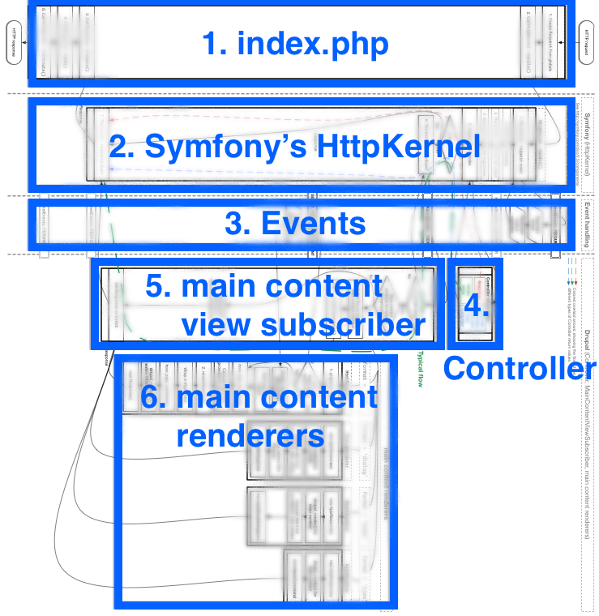

# Formation Développement Drupal

![][4]

.fx: larger

--------------------------------------------------------------------------------

# Objectifs de la formation
  * Appréhender l'environnement de développement Drupal
  * Comprendre les concepts et l'API Drupal 
  * Modifier le comportement d'un module existant 
  * Créer un module
  * Créer un profil d'installation
# Prérequis
  * Connaitre PHP et avoir développé quelques scripts
  * Avoir construit un site avec Drupal
  * Notions de HTML, CSS, JavaScript et requêtes SQL

--------------------------------------------------------------------------------

# 1er jour
  * Rappels PHP
  * Environnement de développement
  * Quelques outils utiles (Drush, Git, Devel)
  * Bonnes pratiques, standards de code, documentation
  * Architecture de Drupal & concepts de base
  * Création du squelette d'un module
  * Les premiers hooks
# 2ème jour
  * Les différentes API
  * Les nœuds, le contenu et les droits d'accès
  * L'alteration des modules

--------------------------------------------------------------------------------

# 3ème jour
  * La form API
  * Les mails
  * Créer un thème basique
  * Les profils d'installation

 
 
 

# Slides disponibles en ligne

# <http://makinacorpus.github.io/makina-slides/drupal8-dev.html>

--------------------------------------------------------------------------------

# Rapidement, ce que vous devez savoir

  * POO
  * Composer
  * Symfony
  * Routage et controlleurs
  * Plugins
  * Injection de dépendences et le conteneur de services

--------------------------------------------------------------------------------

# /!\ Avertissement /!\

## "Going off the island"

  * Drupal 8 est une solution "jeune"
  * Tout a changé depuis Drupal 7
  * Peu de retours d'expérience
  * En phase de stabilisation sur les implémentations ou process

--------------------------------------------------------------------------------

# Rappels PHP

  * PHP 5.5.9 minimum (<http://www.phptherightway.com/>)
  * Programmation orientée Object
  (<http://lornajane.net/posts/2012/introduction-to-php-oop>)
  * Documentation POO officielle (<http://php.net/manual/fr/language.oop5.php>)
  * Namespaces (<https://www.sitepoint.com/php-53-namespaces-basics/>)
  * Annotations
  * Injection de dépendances :
  <http://fabien.potencier.org/what-is-dependency-injection.html>

.fx: alternate

--------------------------------------------------------------------------------

# Les normes PHP

  * Viennent du PHP Framework Interoperability Group (FIG)
  * Différentes normes
    * PSR-0 : autoloader standard
    * PSR-1 : normes de codage de base (Drupal les suit presque)
    * PSR-2 : normes de codage plus poussées (Drupal les suit presque)
    * PSR-3 : interface du logger (pas implémentée dans Drupal)
    * PSR-4 : autoloader amélioré (choisi par Drupal) :
    <https://www.drupal.org/node/2156625>

--------------------------------------------------------------------------------

# Symfony (<http://symfony.com/>)

  * Le plus populaire des frameworks PHP aujourd'hui
  (<http://symfony.com/doc/current/index.html>)
  * Ensemble de composants réutilisables
  * Certains sont réutilisés par Drupal

![][3]

--------------------------------------------------------------------------------

<h2>YAML</h2>

    !yaml
    key: 'value'
    tableau:
      - valeur 1
      - valeur 2

--------------------------------------------------------------------------------

# Composer (<https://getcomposer.org>)

  * Gestionnaire de dépendances utilisé par la communauté PHP
  * Installation uniquement locale au projet
  * composer.json
  * "composer install"
  * composer.lock
  * Contient un autoloader

<pre><code>
  curl -sS https://getcomposer.org/installer | php
  mv composer.phar /usr/local/bin/composer
</code></pre>

  <https://bojanz.wordpress.com/2015/09/18/d8-composer-definitive-intro/>
  <https://adamcod.es/2013/03/07/composer-install-vs-composer-update.html>

--------------------------------------------------------------------------------

# Environnement de développement

.fx: alternate

--------------------------------------------------------------------------------

# Le serveur Web

  * xAMP (Apache, MySQL, PHP) conseillé
  * D'autres possibilités : Nginx / IIS, PostgreSQL
  * Liste des languages utilisés :
    * SQL
    * PHP
    * Javascript
    * HTML
    * CSS

On utilisera dans cette formation _Acquia Dev Desktop_ qui permet d'installer un
environnement de développement avec tous les pré-requis Drupal.

--------------------------------------------------------------------------------

# TP: Installer Drupal 8

  * Choisir la distribution Drupal 8.x simple dans Acquia Dev Desktop
  * Installer le profil d'installation Standard
  * Paramètres
    * Nom du site : Formation
    * Adresse de courriel : formation@example.org
    * Utilisateur : admin
    * Mot de passe : admin

.fx: tp
.notes: présenter les distributions

--------------------------------------------------------------------------------

# L'éditeur de code

  * Le meilleur est celui que vous maitrisez
  * Différence IDE/Editeur simple :
    * Autocomplétion
    * XDebug
    * Refactoring
    * Erreurs de syntaxe
  * Possibilité de télécharger des configurations
  * Exemples : PHPStorm / Eclipse / Netbeans / Atom / Vim

--------------------------------------------------------------------------------

# Les standards de codage*

  * Indentation, espaces : lisibilité du code
  * Nommage, toujours commencer par le nom système : éviter les conflits
    * fonctions
    * constantes
    * variables persistantes
    * classes
    * fichiers
  * Tags `<?php` non fermés : éviter l'envoi du buffer

<strong>A connaître pour comprendre et être compris</strong>

# <https://drupal.org/coding-standards>

\* <small>basés sur le standard PEAR</small>

--------------------------------------------------------------------------------

# TP: Configuration de PHPStorm
  * Ouvrir le dossier Drupal dans PHPStorm
  * Afficher les messages de journal de PHPStorm
  * Cliquer sur "Enable Drupal support" et configurer le chemin
  * Cliquer sur "Fix extensions"

Avantages :

  * code style implémenté
  * navigation dans les hooks (appels et déclarations)
  * installation d'XDebug facile
  (<http://redcrackle.com/blog/drupal-8/phpstorm>)

.fx: tp

--------------------------------------------------------------------------------

# Les modules Drupal utiles au développement
  * _Features_: transférer la configuration dans le code
  * _Devel_ : debug et informations sur les données
  * _Drupal Console_ : générateur de code
  * _Drush_ : administration (DRUpal SHell) & téléchargement de modules et
  librairies
  * _Coder_ : revue de code
  * _Masquerade_ : changer d'utilisateur sans se déconnecter
  * _Examples for developpers_ : démonstrations de l'utilisation de l'API
  * Ne pas utiliser les caches durant le développement
  (<https://www.drupal.org/node/2598914> / <http://www.tothenew.com/blog/is-your-drupal-8-ready-for-writing-codes/>)

--------------------------------------------------------------------------------

# TP: Drush
  * Lancer Drush 
  * Regarder la liste des commandes 
  * Installer un module (features) 
  * Regarder à nouveau la liste des commandes 
  * Sauvegarder la base de données 
  * Installer les modules utiles au développement : devel, masquerade, examples
  * Desactiver le module help

.fx: tp

--------------------------------------------------------------------------------

# TP : Console
  * Intaller la console Drupal
  * Vérifier que c'est correctement installé
  * Regarder la liste des commandes (drupal list)

![][5]

.fx: tp

--------------------------------------------------------------------------------

# Exemples de commandes souvent utilisées

  * `drupal site:mode dev`
  * `drupal generate:module`
  * `drupal generate:plugin:block`
  * `drupal generate:routesubscriber`
  * `drupal generate:form:config`

--------------------------------------------------------------------------------

# Le meilleur moyen d'installer Drupal 8

  * `composer create-project drupal-composer/drupal-project:8.x-dev some-dir --stability dev --no-interaction`

  * `composer create-project drupal/drupal my_site_name` installe un nouveau site
  * composer require drupal/core ~8.3 --update-with-dependencies` met à jour le cœur

--------------------------------------------------------------------------------

# Git et la gestion de versions

  * Utilisé par beaucoup de développeurs dans le milieu du web

  * Très utile pour patcher des modules car utilisé par la communauté Drupal et
  sur drupal.org

  * Une connaissance basique de quelques commandes suffit

    * git clone
    * git add
    * git commit
    * git diff

  * Possibilité d'avoir une interface graphique : SourceTree, Gitg, GitLab,
  GitHub

--------------------------------------------------------------------------------

# L'architecture de Drupal

.fx: alternate

--------------------------------------------------------------------------------

# Présentation de l'arborescence

Cœur de Drupal 
Modules de tous les sites 
Profils d'installations 
Répertoire spécifique au site 
Répertoire d'upload par défaut 
Fichiers de configuration 
- 
- 
- 
- 
- 
Thèmes de tous les sites 

  
Où travailler ? Dans un profil d'installation custom ou dans un
sous-repertoire `custom`

## <u>/!\</u> Le hack du core et l'avenir des chatons

--------------------------------------------------------------------------------

--------------------------------------------------------------------------------

--------------------------------------------------------------------------------

#TP: Jetons un œil à la base de données

  * se familiariser avec PhpMyAdmin
  * identifier les tables des modules actuellement activés
  * identifier les autres : cache, variable, registry
  * identifier la table contenant la configuration
  * <https://www.drupal.org/node/1785994>

.fx: tp

--------------------------------------------------------------------------------

# Qu'est ce qu'un module ?
  * `.info.yml` (<https://www.drupal.org/node/2000204>)
    * `name`
    * `core`
    * `type: module` /!\
  * `.module` (souvent vide en D8)
  * `.install` facultatif (configuration désormais indépendante)
  * répertoire "config/install" pour la configuration
  * répertoire "src" pour les Plugins, Controller, Form, ...

--------------------------------------------------------------------------------

# Structure d'un module

![][2]

<https://www.drupal.org/node/2560405>

--------------------------------------------------------------------------------

# Fil rouge : le module Premium

  * Créer deux permissions pour les rôles, une pouvant affecter le status
  premium aux contenus et l'autre le voir
  * Créer un bloc affichant si l'utilisateur a la permission de voir les
  contenus premium
  * Administrer les types de contenus concernés par le statut premium
  * Altérer le formulaire d'édition de nœud pour ajouter le statut premium
  * Envoyer un mail aux utilisateurs ayant la permission de voir les contenus
  premium lorsque qu'un nouveau contenu premium apparait sur le site
  * Lister les contenus avec le statut premium
  * Créer un style d'image pour illustrer les contenus premium
  * Créer une fonction de theme pour afficher le statut premium d'un nœud
  * Créer des tests pour vérifier le bon fonctionnement du module

Créer ce module : il doit simplement apparaître dans la liste des modules.

.fx: tp

--------------------------------------------------------------------------------

# La création d'un module

.fx: alternate

--------------------------------------------------------------------------------

# Avant de commencer

## Votre bible : api.drupal.org

  Recense toutes les fonctions de Drupal, et leur documentation. Un IDE aura
  cette même documentation dans le code.

  Aborde certains topics en profondeur : form API, schema API, hooks, etc

  <https://api.drupal.org/api/drupal/core%21core.api.php/group/extending/8.1.x>

 
## Votre guide : modules `examples`

  Pour chaque concept de Drupal, des exemples concrets d'utilisation (ajax,
  form, blocks, cache, render, cron, dbtng, email, menu, node_access,
  theming, ...).

  Ils sont fonctionnels : on peut les activer et voir leur impact en terme
  d'interface.

  Très bien documentés, ne pas hésiter à lire, comprendre et reprendre le code
  de ces modules.

--------------------------------------------------------------------------------

# Les hooks 

  * Concept historique Drupal
  * Implémenter `hook_form_alter()` donnera `mon_module_form_alter()`
  * Poids des modules et altération
  * Répondent à des déclencheurs
  * Des hooks peuvent être déclarés par des modules contrib
  * Rappel: on ne « hack » JAMAIS le core <small>(sauf en cas de module
  bogué)</small>
  * Tend à disparaître avec Drupal 8 (Plugins, yml, events), mais existe encore...
  * Les implémentations sont mise en cache
  * Liste des hooks
  <https://api.drupal.org/api/drupal/core!core.api.php/group/hooks/8>

--------------------------------------------------------------------------------

# Les permissions

  * Créer un fichier `.permissions.yml`
  * Créer les deux permissions
  * Vider le cache
  * Créer un role contributeur pouvant affecter le statut premium
  * Créer un role premium pouvant voir le statut premium
  * Créer un utilisateur pour chaque rôle

.fx: tp

--------------------------------------------------------------------------------

# Et pour des permissions dynamiques ?

    !yaml
    permission_callbacks:
      - \Drupal\my_module\MyClass::myFunction

--------------------------------------------------------------------------------

# Les plugins & les annotations

  * Plugins : <https://www.drupal.org/node/2087839>
  * Annotations très utilisé dans le cœur : pour tous le plugins (block, entre
  autres) : <https://www.drupal.org/node/1882526>
  * <https://api.drupal.org/api/drupal/core%21core.api.php/group/annotation/8.1.x>

--------------------------------------------------------------------------------

# Les blocs

fichier src/Plugin/Block/TestBlock.php

    !php
    namespace Drupal\mon_module\Plugin\Block;
    use Drupal\Core\Block\BlockBase;
    /**
     * Provides a 'Test' block.
     * 
     * @Block(
     *   id = "test_block",
     *   admin_label = @Translation("Test block"),
     * )
     */
    class TestBlock extends BlockBase {
      public function build() {
        return array('#markup' => '',);
      }
    }

    // Altération
    function hook_block_view_BLOCK_ID_alter(&$build, $block) {}

--------------------------------------------------------------------------------

# TP: Notre premier bloc

Créer un bloc :

  - dont le titre côté administration est "Statut premium de l'utilisateur"
  - dont le delta (nom machine) est `premium_status`
  - qui affiche "Vous pouvez voir les contenus premium" ou "Vous ne pouvez pas
  voir les contenus premium"

Rappel: \Drupal::currentUser()->hasPermission(); pour vérifier les permissions

Attention au cache d'implementations

.fx: tp

--------------------------------------------------------------------------------

# Render Arrays

Les render arrays sont les blocs constituant une page Drupal. Ce sont des arrays
PHP qui définissent des données (c-a-d la structure) ; On est obligés de
produire des render arrays.
Ceci afin qu'ils puissent être modifiés via les hooks d'altérations ou par la
couche de theming.

Les propriétés sont toujours préfixées par un `#` et la propriété par défaut
est `#markup`, elle permet d'indiquer du balisage simple.
Un render array est converti en HTML avec la fonction `render();`

    !php
    // Un render array simple
    'ma_cle1' => array(
      '#markup' => "<h2>Du texte basique</h2>",
    ),

    // Des propriétés utiles
    'ma_cle2' => array(
      '#markup' => "Du texte basique",
      '#prefix' => '<h2>',
      '#suffix' => '</h2>',
    ),

--------------------------------------------------------------------------------

# Paramètres du render array et propriétés

Une fonction de `#theme` peut être renseignée ainsi que ses paramètres
(<https://www.drupal.org/developing/api/8/render/arrays>)

    !php
    // Un render array qui produit un tableau HTML
    'ma_cle1' => array(
      '#theme' => 'table',
      '#header' => $header,
      '#rows' => $rows,
      '#empty' => "Aucune donnée pour ce tableau",
    ),

Des propriétés utiles :

  - `#type`: Le type d'élement
  - `#cache`: contexts, tags, ... /!\
  - `#markup`: Pour fournir directement de l'HTML
  - `#pre_render` / `#post_render`: agit sur le tableau
  - `#prefix` / `#suffix`, `#weight`, `#attached`, `#access`, ...

--------------------------------------------------------------------------------

# Render Arrays

    !php
    // Un render array en html
    render($array);
    // (quasiment jamais invoqué directement)

    // Un objet en render array
    $object->toRenderable();

--------------------------------------------------------------------------------

# TP

Ajouter un '&lt;h3&gt;' autour du bloc précédent

.fx: tp

--------------------------------------------------------------------------------

# TP: Manipuler les render arrays

  Altérer le bloc dans un `hook_block_view_BASE_ID_alter()` afin de changer le
  `<h3>` en `<h4>`

  -> Impossible à faire directement... Il faut ajouter un #pre_render dans le
  hook_block_view_alter(), et la fonction appelée dans le pre_render aura accès
  au $build du contenu du bloc.

.fx: tp

--------------------------------------------------------------------------------

# Système de routage / menus

## Quelques définitions :
  * routage : faire pointer une route (`node/{node}`) à une action (afficher un
  noeud)
  * chemin (ou path) : route dont les arguments sont définis (ex: `node/123` est 
  un chemin, pointant vers la route `node/{node}` où l'argument est 123)
  * lien de menu : Texte (ou titre) pointant vers un chemin
  * alias : associe un chemin système (`node/123`) vers un chemin arbitraire 
  renseigné par le contributeur (`mon-noeud`)

## Les propriétés d'une route
  * _Permissions
  * Les arguments sont nommés (`{node}`) et peuvent être chargés dans le
  Controller (en les typant avec une classe)
  * Vous pouvez passer des paramètres fixes au controller en les indiquant
  dans la route

--------------------------------------------------------------------------------

# Les controllers

fichier src/Controller/ModuleController.php :

    !php
    <?php
    namespace Drupal\mon_module\Controller;

    use Drupal\Core\Controller\ControllerBase;

    /**
     * Provides a basic controller.
     */
    class ModuleController extends ControllerBase {
      public function abc_view() {
        return array('#markup' => '',);
      }
    }

--------------------------------------------------------------------------------

  * Type d'élément de menu
    * *.routing.yml -> définit une URL
    * *.links.menu.yml -> lien de menu dans l'arborescence
    * *.links.task.yml -> onglet
    * *.links.action.yml -> "action" (back-office)

  * Paramètres de routage : <https://www.drupal.org/node/2092643>

--------------------------------------------------------------------------------

# Exemples de routage

    !yaml
    #.routing.yml
    mymodule.abc_view:
      path: '/abc/def'
      defaults:
        _title: "My ABC page"
        _controller: "\Drupal\module\Controller\ModuleController::abc_view"
      requirements:
        _permission: 'access my module'

    # , = ET
      requirements:
        _permission: 'access my module,access content'
    # + = OU
      requirements:
        _permission: 'access my module+access content'
    # Personnalisé
      requirements:
        _custom_access: '\Drupal\my_module\MyClass::my_function'

La function renvoit alors AccessResult::allowed() ou AccessResult::forbidden()

--------------------------------------------------------------------------------

# Ajout de liens / onglets

    !yaml
    #.links.menu.yml
    mymodule.abc_view_tab:
      title: 'My ABC page'
      route_name: mymodule.abc_view
      description: 'Displays my ABC page'
      parent: mymodule.abc_view

    #.links.task.yml
    mymodule.abc_view_edit:
      title: 'Edit'
      route_name: mymodule.abc_view_edit
      base_route: mymodule.abc_view

    #.links.action.yml pour les actions

--------------------------------------------------------------------------------

# TP: Création de page

Créer une page _Suis-je Premium ?_ reproduisant le comportement du bloc

  - url : suis-je-premium

Créer une page _Est-il Premium ?_ affichant la même chose, mais avec en
argument l'uid de l'utilisateur

  - url d'exemple : est-il-premium/2

Créer une page _Page Premium_ avec du contenu "Lorem Ipsum" et ne
s'affichant que si l'utilisateur courant à la permission de voir le contenu
premium

  - url : page-premium

.fx: tp

--------------------------------------------------------------------------------

# Quelques routes spéciales

  * &lt;front&gt;
  * &lt;nolink&gt;

Pour voir les routes, utilisez la console : `drupal router:debug`

--------------------------------------------------------------------------------

# Comment convertir les paramètres dans les routes

Utiliser des [ParamConverter](https://www.drupal.org/docs/8/api/routing-system/implementing-custom-parameter-converters)

--------------------------------------------------------------------------------

# Gestion des nodes et des users

Quelques fonctions de l'API à connaitre :

  * `\Drupal::currentUser()` : utilisateur actuellement connecté
  * `Node::load()` et `Node::loadMultiple()` pour charger des nœuds
  * `User::load()` et `User::loadMultiple()` pour charger des utilisateurs
  * `$entity->save()` pour enregistrer un nœud, un utilisateur, ...
  * `$user->getDisplayName()` pour afficher un nom d'utilisateur
  * `Node::create(['type' => article])->save();`
  * `$node->set('body' => ['value' => 'My body']); $node->save();`

--------------------------------------------------------------------------------

# Gestion de la base de données /!\ en cours de modification /!\

## Requête en base de données

    !php
    $db = \Drupal::database();
    $result = $db->select();
    $result = $db->insert();
    $result = $db->delete();
    $result = $db->udpate();
    $result = $db->merge();

## Requête sur le modèle objet

    !php
    $ids = \Drupal::entityQuery('user')->condition('name', 'test')->execute();
    $users = User::loadMultiple($ids);

[Documentation complète](https://api.drupal.org/api/drupal/core%21lib%21Drupal%21Core%21Database%21database.api.php/group/database/8.1.x)

--------------------------------------------------------------------------------

## DBTNG : DataBase The Next Generation (issu de Drupal 7)
    !php
    $results = $db->select('contact', 'c')
                  ->fields('c')
                  ->condition('created', REQUEST_TIME)
                  ->execute() // ->fetch*()
                  ;
    foreach ($results as $result) {
      // faire qqch
    }

Récupération de résultats :

  - fetchField() : la première colonne du premier résultat
  - fetchCol() : la première colonne sous forme d'array
  - fetchAssoc() : le premier résultat sous forme d'objet
  - fetchAllAssoc() : tous les résultats sous forme d'objet
  - fetchAllKeyed() : tous les résultats sous forme de tableau indexé par la
  1ere colonne avec pour valeur la 2e

--------------------------------------------------------------------------------

# Gestion des URLs et des paths

## Quelques fonctions

  * $this->redirect('contact.site_page'); -> redirection
  * `global $base_url` -> http://monsite.com
  * `base_path()` -> `/` ou `/mon-dossier-drupal`
  * `drupal_get_path()` (module, theme) -> chemin vers un module ou un thème
  (`drupal_get_path('module', 'devel')` donne _modules/devel_)

## L'objet URL
    !php
    use Drupal\Core\Url;
    // Récupérer une Url.
    $url = Url::fromRoute('contact.site_page', array())->toString();
    $url = Url::fromUserInput('/contact')->toString();
    // Ou générer un lien.
    $link = Link::createFromRoute('text', 'route');
    $link = Link::fromTextAndUrl('text', $url);

--------------------------------------------------------------------------------

# TP: Création de page

Créer une page _Utilisateurs premium_ listant les utilisateurs du site ayant un
accès premium.

  * Créer une page

  * Récupérer les utilisateurs ayant un rôle permettant de voir le contenu
  premium (->condition('roles', '...'))

  * Les afficher d'abord dans une liste ('#theme' => 'item_list')

  * Modifier pour les afficher dans un tableau ('#theme' => 'table') avec
  _Identifiant_, _Nom_, _Lien vers son profil_

.fx: tp

--------------------------------------------------------------------------------

# Altérer le comportement des modules existants

## Solution "historique" : les hooks

  * `hook_XXXXXXX_alter()` : permettent de _modifier_ des données créés par
  d'autres modules
  * [Liste des hooks](https://api.drupal.org/api/drupal/core%21core.api.php/group/hooks/8.1.x)

## "Nouveauté" Drupal 8 : les Events symfony

  * On "s'inscrit" à un événement (via un service) pour que le système nous
  appelle automatiquement et qu'on puisse _réagir_
  * [Liste des Events](https://api.drupal.org/api/drupal/core%21core.api.php/group/events/8.1.x)

--------------------------------------------------------------------------------

# Concrètement

## Une classe pour la réponse à l'évènement
    !php
    namespace Drupal\my_module\EventSubscriber;
    use Symfony\Component\EventDispatcher\EventSubscriberInterface;
    use Symfony\Component\HttpKernel\KernelEvents;
    class MyModuleSubscriber implements EventSubscriberInterface {
      static function getSubscribedEvents() {
        $events[KernelEvents::REQUEST][] = array('my_function');
        return $events;
      }
      function my_function(GetResponseEvent $event) {
        $event->setResponse(new RedirectResponse('http://example.com/'));
      }
    }

## Un service (fichier `my_module.services.yml`)
    !yaml
    services:
      my_module.redirect_all:
        class: Drupal\my_module\EventSubscriber\MyModuleSubscriber
        tags:
          - {name: event_subscriber}

--------------------------------------------------------------------------------

# Exemple : modification du routage des autres modules
    !php
    use Drupal\Core\Routing\RouteSubscriberBase;
    use Symfony\Component\Routing\RouteCollection;

    class RouteSubscriber extends RouteSubscriberBase {
      public function alterRoutes(RouteCollection $collection) {
        if ($route = $collection->get('user.login')) {
          $route->setPath('/login');
        }
        if ($route = $collection->get('user.logout')) {
          $route->setRequirement('_access', 'FALSE');
        }
      }
    }

## C'est un event...
    !yaml
    services:
      example.route_subscriber:
        class: Drupal\example\Routing\RouteSubscriber
        tags:
          - { name: event_subscriber }

<https://www.drupal.org/node/2187643>

--------------------------------------------------------------------------------

# TP : Events & Hooks

## Events

Empêcher d'accéder à l'édition du profil d'un utilisateur (/user/{user}/edit)
en interdisant l'accès à la route.

## Hooks

Faites la même chose en supprimant juste le lien de menu
(hook_menu_local_tasks_alter)

.fx: tp

--------------------------------------------------------------------------------

# Bonus : déclencher des évènements

    !php
    $dispatcher = \Drupal::service('event_dispatcher');
    $dispatcher->dispatch('my_object.my_event', $params);

--------------------------------------------------------------------------------

# Les évènements déclenchés par le cœur

  * kernel.request : Au début de la gestion de la requête
  * kernel.response : Une fois que la réponse est créée
  * routing.route_dynamic : Permet aux modules d'enregistrer d'autres routes
  * routing.route_alter : Permet de modifier les routes existantes

--------------------------------------------------------------------------------

# Que se passe-t-il sur Kernel.request ?

  * AuthenticationSubscriber : Charge la session et initialize currentUser().
  * LanguageRequestSubscriber : Détecte la langue courante
  * PathSubscriber : Convertit l'URL en chemin système
  * LegacyRequestSubscriber : Permet de définir un thème par défaut
  * MaintenanceModeSubscriber : Affiche la page de maintenance si besoin
  * RouteListener : Récupère le router chargé entièrement
  * AccessSubscriber : Vérifie que le visiteur a accès à la route

--------------------------------------------------------------------------------

# La Form API

<https://www.drupal.org/node/2117411>

.fx: alternate

--------------------------------------------------------------------------------

Un formulaire est une structure déclarative composée d'éléments de la form API.
La majeure partie des traitements est effectuée par celle-ci, rendant la
création ou la modification de formulaire rapide et sécurisée.

Référentiel des composants disponibles [sur api.drupal.org](
https://api.drupal.org/api/drupal/developer!topics!forms_api_reference.html/8)

    !php
    \Drupal::formBuilder()->getForm('Drupal\mymodule\MyModuleForm');

    // Déclaration
    public function getFormId() {
      return 'my_module_form';
    }
    public function buildForm(array $form, FormStateInterface $form_state) {
      $form['submit'] = array(
        '#type' => 'submit',
        '#value' => t('Submit'),
      );
      return $form;
    }
    public function validateForm(array &$form, FormStateInterface $form_state) {
      // Logique de validation.
      $form_state->setErrorByName('form_field', 'message');
    }
    public function submitForm(array &$form, FormStateInterface $form_state) {
      // Traitement des données soumises.
    }

--------------------------------------------------------------------------------

# Traitement des données

Les données soumises et validées sont contenues dans
`$form_state->getValue('key')`.

Après exécution du `_submit()`, l'utilisateur est redirigé vers le formulaire
vidé de ses valeurs, ou bien vers une route définie par
`$form_state->setRedirectUrl($url)`

Chaque formulaire a un identifiant unique qui permet de l'altérer facilement par
les autres modules.

  * Validation par élément (`#element_validate`)
  * \#ajax (<https://api.drupal.org/api/drupal/core!core.api.php/group/ajax/8>)
  permet de faire de l'Ajax sans ecrire de JS
  (<https://www.sitepoint.com/using-ajax-forms-drupal-8/>)
  * \#autocomplete_route_name

--------------------------------------------------------------------------------

# Appeler un formulaire directement depuis le routage
    !yaml
    example.form:
      path: '/example-form'
      defaults:
        _title: 'Example form'
        _form: '\Drupal\mymodule\Form\ExampleForm'

--------------------------------------------------------------------------------

# TP : Form API

But: définir pour quels types de contenu la fonctionnalité premium est activée.
C'est-à-dire, sur quels types on affichera l'option "Contenu premium" dans les
formulaires de création ou de modification de nœud.

  * Créer un formulaire listant les types de contenu avec pour chaque une
  checkbox

<code>
<label>Types de contenu pour lesquels activer la fonctionnalité Premium :</label> 
<input type="checkbox"> Article  
<input type="checkbox"> Page de base   
<button>Enregistrer</button>
</code>

.fx: tp

--------------------------------------------------------------------------------

# TP : Form API

  * Valider le fait qu'on ne peut pas choisir le type de contenu _Page de base_

.fx: tp

--------------------------------------------------------------------------------

# Gestion de la configuration

  * <https://www.drupal.org/node/1905070>
  * $config = \Drupal::service('config.factory')->getEditable('monmodule.settings');
  * `$config->set('name', value)->save();` pour définir
  * $config = \Drupal::config('monmodule.settings');
  * `$config->get('name');` pour récupérer
  * $config = \Drupal::service('config.factory')->getEditable('monmodule.settings');
  * `$config->clear('name')->save();` pour supprimer une valeur
  * $config = \Drupal::service('config.factory')->getEditable('monmodule.settings')->delete();

Documentation de l'API sur <https://www.drupal.org/node/1809490>

--------------------------------------------------------------------------------

# Déclaration de la configuration

  * /config/install/mon_module.settings.yml -> initialisation à l'installation
  * /config/optionnal/module1.type1.name1.yml -> si module1 est activé
  * /config/schema/mon_module.schema.yml -> schéma de la configuration de votre
  module

## Exemple de fichier de schema

    !yaml
    mon_module.settings:
      type: config_object
      mapping:
        settings_1:
          type: boolean
          label: 'Settings 1'
        settings_2:
          type: string
          label: 'Settings 2'

--------------------------------------------------------------------------------

# TP : Form API

  * A la soumission enregistrer les valeurs dans une variable persistante
  `'premium_types'`
  * Attention, il faut désinstaller et réinstaller votre module pour que Drupal
  connaisse votre configuration

.fx: tp

--------------------------------------------------------------------------------

# TP : Form API

  * Cocher les checkbox par défaut lorsque le type de contenu est activé
  (en lisant depuis la configuration)

.fx: tp

--------------------------------------------------------------------------------

# Formulaire de configuration

  * Utiliser ConfigFormBase

--------------------------------------------------------------------------------

# Themer précisément un formulaire

<http://www.foreach.be/blog/how-manipulate-forms-drupal-8>

<http://drupal.stackexchange.com/questions/146434/send-a-form-to-twig-template>

--------------------------------------------------------------------------------

# En bonus, Manipuler les "Form Modes"

    !php
    $this->entityFormBuilder()->getForm($form_id, 'form_mode');

--------------------------------------------------------------------------------

# Fournir un style par défaut

  Dans un fichier de configuration '/config/install/image.style.mon_style.yml'
  (l'exporter depuis l'interface)

    !yaml
    status: true
    dependencies: {  }
    name: mon_style
    label: 'mon style'
    effects:
      mon_style_desaturate:
        uuid: mon_style_desaturate
        id: image_desaturate
        weight: 1
        data: {  }

--------------------------------------------------------------------------------

# TP: Créer un style d'image pour nos contenus premium

Celui-ci nous servira pour les images qui seront sur les articles premium

.fx: tp

--------------------------------------------------------------------------------

# Le stockage

  * Ancienne méthode (D7) : on créé ses propres tables manuellement
  * Méthode Drupal 8 : on créé une _entité_ (2 types : configuration ou contenu)
  * Liste des possibilités de stockage D8 :
  <https://www.palantir.net/blog/d8ftw-storing-data-drupal-8>

--------------------------------------------------------------------------------

# Schema API (~ méthode Drupal 7)

  * Gère la base de données
  * Se situe dans le fichier .install
  * `hook_schema()` -> crée une ou plusieurs tables
  * `hook_schema_alter()` déclare une modification (mais ne la réalise pas)
  * [API de la structure](https://www.drupal.org/docs/7/api/schema-api/data-types)
  * [Fonctions de l'API](https://drupal.org/node/150223)
  * Les `hook_update_N()` servent à réaliser des actions sur la structure ou
  les données
  * Très utile pour les mises à jour en production, et le test de celles-ci

--------------------------------------------------------------------------------

# Génération d'entité

  * Recommandation : utiliser la console pour générer l'entité
  * drupal generate:entity:content (ou drupal generate:entity:config)
  * /!\ Attention /!\ : drush entity-updates / drupal update:entities à passer
  après la génération d'une entité pour mettre à jour le schéma de base de
  données

--------------------------------------------------------------------------------

# TP: Enregistrer les statuts

## Déclarer une table premium

Via l'API, déclarer une table avec deux colonnes, nid et status.
Installer cette table via un `hook_update_N()` ou réinstaller le module.

## Altérer le formulaire de noeuds

  * Ajouter la checkbox au dessus du titre

  * Enregistrer la valeur dans notre table à l'enregistrement

  * La mettre à sa valeur par défaut à l'affichage du formulaire

Rappels 

  * `hook_form_alter(&$form, $form_state, $form_id)`
  * Ajouter un callback de submit...
  * Debug : module Devel + `dpm($var)`

.fx: tp

--------------------------------------------------------------------------------

# TP : Contrôler l'accès aux nœuds

Utiliser l'API Node Access ([documentation](https://api.drupal.org/api/drupal/core%21modules%21node%21node.module/group/node_access/8.1.x))

Déclarer le `hook_node_access()` et ne retourner AccessResult::forbidden()
uniquement si les 4 conditions sont réunies :

  1. Je suis en train de voir le nœud
  2. Son type a la fonctionnalité premium activé
  3. C'est un contenu premium
  4. Je n'ai pas la permission de voir les contenu premium

<u>Attention:</u> ne fonctionnera pas pour les listes (dont la page d'accueil)
pour des raisons de performances, il faudrait declarer `hook_node_grants()`.
Rester simple et ne controler l'accès qu'à un nœud complet.

De même `hook_node_access()` n'est pas appelé pour le superadmin.

.fx: tp

--------------------------------------------------------------------------------

# Envoi de mails

    !php
    // Déclaration du contenu du mail avec hook_mail().
    function monmodule_mail($key, &$message, $params) {
      $account = $params['account'];
      $node = $params['node'];
      $message['subject'] = "Bonjour " . format_username($account);
      $message['body'][] = "Le noeud {$node->title} a été créé";
      $message['body'][] = "A bientot";
    }
    
    // Envoi du mail.
    $mailManager = \Drupal::service('plugin.manager.mail');
    $mailManager->mail('monmodule', 'my_key', 'toto@example.com', 'fr-FR', array(
      'node' => node_load(123),
      'account' => user_load_by_name('toto'),
    );

On peut utiliser la notion de tokens (jetons). '`body`' est un tableau de lignes.

La clé permet à un module de gérer plusieurs types de mail.

--------------------------------------------------------------------------------

# TP

## Notification par mail

Envoyer un mail à tous les utilisateurs premium :

<pre>
Sujet: Nouveau contenu premium

Bonjour _Nom d'utilisateur_,
Un nouveau _Type de contenu_ premium a été créé, il s'intitule _Titre_
Vous pouvez le consulter ici : _URL_
Cordialement,
L'équipe du site _Nom du site_
</pre>

## Affichage du statut premium sur le nœud

  - Trouver un hook qui permettrait d'ajouter un message
  `<strong>Contenu premium/strong>` sur chaque contenu premium
  - L'implementer avec #markup

.fx: tp

--------------------------------------------------------------------------------

# Le partie thème d'un module

Le module fournit **toujours** le markup par défaut.

Le `hook_theme()` définit des hooks/clés qui pourront ensuite être utilisés via
la propriété `#theme` des render arrays. Ces _theme hooks_ généreront ensuite
le markup HTML via un template.

On peut fournir des variables à ces _theme hooks_. Des fonctions preprocess
peuvent ajouter ou modifier des variables, et également ajouter des
suggestions de templates.

--------------------------------------------------------------------------------

## Déclaration et appel

    !php
    function forum_theme() {
    	return array(
    		'forums' => array(
    			'template' => 'forums',
    			'variables' => array(
    				'forums' => NULL,
    				'topics' => NULL,
    			),
    		),
    	);
    }

    $html_output = theme('forums', array(
      'forums' => $forums,
      'topics' => $topics,
    ));

    // Mais toujours privilégier les render arrays, car altérables
    $build['forums'] = array(
      '#theme' => 'forums',
      '#forums' => $forums,
      '#topics' => $topics,
    );

--------------------------------------------------------------------------------

# Fonctions de theme

Exemples d'utilisations de `theme()` :

  * table
  * item_list
  * pager
  * links
  * image

[Liste complete des implementation de theme du cœur](https://api.drupal.org/api/drupal/core!lib!Drupal!Core!Render!theme.api.php/group/themeable/8)

    !php
    $image = array(
        '#theme'  => 'image',
        '#path' => drupal_get_path('module', 'monmodule') . '/monimage.png',
    );
    print drupal_render($image); // Quasi-automatiquement appelé par les hooks

<https://www.drupal.org/developing/api/8/render/pipeline#html-main-content-renderer-pipeline>

--------------------------------------------------------------------------------

# Implémentation du hook_theme()

  * Fonction template_preprocess_forums()
  * fichier "templates/forums.html.twig"

--------------------------------------------------------------------------------

# Twig

  * Un template engine pour PHP
  * Créé par Fabien Potencier (Symfony)
  * [Documentation](http://twig.sensiolabs.org)
  * Très sécurisé
  * Extensible

--------------------------------------------------------------------------------

# Exemple de syntaxe

    !twig
    <!DOCTYPE html>
    <html lang="{{ language.language }}" dir="{{ language.dir }}">
      <head>
        <meta charset="utf-8">
        {{ head }}
        <title>{{ head_title }}</title>
        {{ styles }}
      </head>
      <body class="{{ classes }}" {{ attributes }}>
        {{ page_top }}
        {{ page }}
        {{ scripts }}
        {{ page_bottom }}
      </body>
    </html>

--------------------------------------------------------------------------------

# 3 syntaxes à connaître

  * {{ afficher }}
  * {# commenter #}
  * 

--------------------------------------------------------------------------------

# Afficher

![][1]

--------------------------------------------------------------------------------

# Programmer

  *   
  *  () 

--------------------------------------------------------------------------------

# Les filtres

  * {{ messages | join(', ') }}
  * {{ "now" | date('d/m/Y H:i') }}
  * {{ 'Home' | t }} (ajouté par Drupal)
  * {{ content.field_date | format_date('short') }} (ajouté par Drupal)
  * Voir core/lib/Drupal/Core/Template/TwigExtension.php pour la liste des
  rajouts Drupal
  * Sur toute une section :  Texte 

  * abs, batch, capitalize, convert_encoding, date, date_modify, default, escape,
  first, format, join, json_encode, keys, last, length, lower, merge, nl2br,
  number_format, raw, replace, reverse, round, slice, sort, split, striptags,
  title, trim, upper, url_encode

--------------------------------------------------------------------------------

# Les fonctions

  * dump(node)
  * {{ max(1, 3, 2) }}
  * {{ random(['pomme', 'orange', 'citron']) }}
  * \+ celles fournies par Drupal : <https://www.drupal.org/node/2486991>
    * link()
    * path()
    * url()
    * attach_library()

--------------------------------------------------------------------------------

# Inclusion de template

  * 

--------------------------------------------------------------------------------

# Héritage de template

    !twig
    {# Template A #}
    
      
Mon premier paragraphe

    

    {# Template B #}
    
    
      {{ parent() }}
        
Mon deuxième paragraphe

    

    {# Rendu Template B #}
    
Mon premier paragraphe

    
Mon deuxième paragraphe

--------------------------------------------------------------------------------

# Hiérarchie des templates Drupal

![][7]

--------------------------------------------------------------------------------

# Le nommage des templates

  * <https://www.drupal.org/node/2354645>
  * Pour Views : <http://redcrackle.com/blog/drupal-8/theme-views-templates>

--------------------------------------------------------------------------------

# Debug Twig dans Drupal

    !yaml
    parameters:
      twig.config:
        debug: true

dans sites/default/services.yml

+ `{{ dump(_context|keys) }}` pour voir tout ce qui est disponible

--------------------------------------------------------------------------------

# Création de theme avec un my_theme.info.yml

    !yaml
    name: My Theme
    type: theme
    version: 0.1
    core: 8.x
    regions:
      branding: "Branding"
      header: "Header"
      breadcrumb: "Breadcrumb"
      content: "Content"
      footer: "Footer"
    regions_hidden:
      - sidebar_first
      - sidebar_second
    libraries:
      - my_theme/global_styling

--------------------------------------------------------------------------------

# TP: Créer un template pour premium

Utiliser dans le hook_node_view() un render array #markup pour afficher

Convertir le render array utilisé pour utiliser une fonction de theme (et donc
un template), en implémentant un hook_theme().

Passer en paramètre le nœud et transformer "Contenu premium" en "_Titre du nœud_
est un contenu premium".

Ajouter une image de médaille dans ce template.

Créer un preprocess pour transformer cette image en variable.

Dans le preprocess, transformer l'image en render array, et utiliser la fonction
render() dans le template.

Ajouter des suggestions pour ce template.

.fx: tp

--------------------------------------------------------------------------------

# Ajout de JS / CSS

    !yaml
    global-styling:
      css:
        theme:
          css/style.min.css
      js:
        js/theme.js
      dependencies:
        - core/jquery
        - core/drupal.ajax

  * Tout est sous forme de bibliothèque
  * \#attached[] -> au moment du rendering
  * drupal_add_library()
  * [Adding stylesheets and JavaScript to a Drupal 8 module](https://www.drupal.org/node/2274843)

--------------------------------------------------------------------------------

# Surcharge de bibliothèque (my_theme.info.yml)

    !yaml
    libraries-override:
      classy/base:
        css:
          components:
            css/components/menu.css: false
      user/drupal.user: false
      # jQuery Update
      core/jquery:
        js:
          assets/vendor/jquery/jquery.min.js: js/jquery-5000.max.js

--------------------------------------------------------------------------------

# Extension de bibliothèques (my_theme.info.yml)

    !yaml
    libraries-extend:
      user/drupal.user:
        - my_theme/user
      classy/node:
        - my_theme/node

--------------------------------------------------------------------------------

# TP: Faire flotter l'image à droite

Ajouter une classe à l'image et créer un fichier CSS:

    !css
    img.premium-icon {
      float: right;
    }

L'ajouter lorsqu'un noœud premium est affiché.

.fx: tp

--------------------------------------------------------------------------------

# Le javascript

  * Bonnes pratiques 
  * Jquery (inclus dans Drupal) 
  * Le « Drupal way » 

## Bonnes pratiques JS

  * « Unobtrusive javascript » 
    * Surcouche 
    * Comportements dégradés 
    * Accessibilité 

Voir les modules `example`

--------------------------------------------------------------------------------

# Les librairies JS fournies avec le cœur

  * jQuery
  * jQuery UI
  * Backbone
  * Underscore

--------------------------------------------------------------------------------

# Les services

  * <https://api.drupal.org/api/drupal/services/8.1.x>
  * Les services à connaître :
    * router.admin_context (->isAdminRoute())
    * path.matcher (->isFrontPage() / ->match())
    * plugin.manager.mail (->mail())
    * title_resolver (->getTitle())
    * entity_type.manager (->getStorage())
    * ...

--------------------------------------------------------------------------------

# La File API

  * Différence entre fichiers gérés et non gérés
  * Différence entre fichiers privés et fichiers publics
  * API complète <https://api.drupal.org/api/drupal/core!includes!file.inc/group/file/8>

## Les streams wrappers

Un stream est un chemin, une URI, vers un fichier interne ou externe :

  * public://
  * private://

--------------------------------------------------------------------------------

# En résumé : la vie d'une page Drupal

![][8]

--------------------------------------------------------------------------------

# En résumé : la vie d'une page Drupal

![][9]

--------------------------------------------------------------------------------

# Fonctionnalités avancées

.fx: alternate

--------------------------------------------------------------------------------

# On peut valider les entités

<https://www.drupal.org/node/2015613>

    !php
    $violations = $entity->validate();
    $violations->count(); // extends \IteratorAggregate
    $violation->getMessage();

## 4 niveaux de validation

  * l'entité ($entity)
  * un champ (global) de l'entité ($entity->field_invalid)
  * une valeur d'un champ de l'entité ($entity->field[0])
  * la propriété d'une valeur d'un champ de l'entité ($entity->field[0]['invalid_value'])

## Pour une validation personnalisée

  * un plugin de Constraint
  * un Validator

--------------------------------------------------------------------------------

# Le cache

<http://md-systems.github.io/drupal-8-caching>

    !php
    $key = 'my-unique-cache-key';
    if ($cache = \Drupal::cache()->get($key)) {
      $data = $cache->data;
    } else {
      $data = my_slow_calculation();
      \Drupal::cache()->set($key, $data);
    }

    // Alternative for multiple items
    \Drupal::cache()->getMultiple($keys);
    \Drupal::cache()->setMultiple($items);

--------------------------------------------------------------------------------

# Le cache de rendu

  * Les clés : comment identifier ce cache
  * Les contextes : Qu'est ce qui fait varier ce cache ('language',
  'user.permissions', 'user.role', 'url')
  * Les tags : à quoi est associé ce cache ('node:X',
  `EntityInterface::getCacheTags()`, 'config.system.performance')
  * La durée de conservation (si on veut la forcer), avec 2 valeurs spéciales :
    * 0 (ne pas conserver en cache)
    * Cache::PERMANENT (ne pas expirer selon le temps, uniquement selon les tags)

## Comment l'implémenter
    !php
    $build['#cache'] = array(
      'keys' => 'my_cache',
      'contexts' => 'url',
      'tags' => array(),
      'max-age' => Cache::PERMANENT,
    );

Directement dans le render array

--------------------------------------------------------------------------------

# Liste des contextes

<https://www.drupal.org/developing/api/8/cache/contexts>

  * cookies
  * headers
  * ip
  * languages
  * request_format
  * route
  * session
  * theme
  * timezone
  * url (url.query_args, url.path, url.host, ...)
  * user (user.roles, user.permissions, ...)

3 contextes par défaut sur tous les éléments (dans le services.yml) :

    !yaml
    parameters:
      renderer.config:
        required_cache_contexts: ['languages:language_interface', 'theme',
        'user.permissions']

--------------------------------------------------------------------------------

# La sécurité

  * "Valider les entrées, filtrer les sorties"

## Concrètement
  * URL : `Html::escape(UrlHelper::stripDangerousProtocols($uri));`
  * Texte brut : `Html::escape($string);`
  * Texte riche : `check_markup($text, $format_id = NULL, $langcode = '',
  $filter_types_to_skip = array());`
  * HTML : `Xss::filter($string, array $html_tags = NULL);`
  * Sinon, on considère que le texte est validé

## En bonus, déplacez les fichiers
  * <https://www.drupal.org/node/2767907>

--------------------------------------------------------------------------------

# Les Web Services

## Appel (avec Guzzle)
    !php
    // GET
    $request = \Drupal::service('http_default_client')->get($url, [
      'auth' => ['username','password']
    ]);
    $status = $request->getStatusCode();
    $response = $request->getBody();
    // POST
    $request = $client->post($url, [
      'json' => [
        'id'=> 'data-explorer'
      ]
    ]);
    $response = json_decode($request->getBody());

  * Exceptions dans ./vendor/guzzlehttp/guzzle/src/Exception
  * Documentation sur <http://docs.guzzlephp.org/en/latest/>

--------------------------------------------------------------------------------

# Les Web Services

## Réponse (dans un Controller)
    !php
    return new JsonResponse($values);

--------------------------------------------------------------------------------

# Utilisation des APIs de Web Services du cœur

    !php
    $output = $this->serializer->serialize($entity, 'json');
    $entity = $this->serializer->deserialize($output,
    \Drupal\node\Entity\Node::class, 'json');

<https://www.drupal.org/developing/api/8/serialization>

<https://www.drupal.org/node/1899288>

![][6]

--------------------------------------------------------------------------------

# Intégrer des données à Views

## Des entités

  * C'est (presque) natif !
  * Drupal console le génère pour vous.

## Des tables "legacy"

  * Utiliser le hook_views_data()
  * [documentation](https://api.drupal.org/api/drupal/core!modules!views!views.api.php/function/hook_views_data/8.1.x)

--------------------------------------------------------------------------------

# Modifier des données de Views

## Les données elles-mêmes

  * hook_views_data_alter()

## Leur affichage

  * Views utilise des Plugins :
    * Field
    * Sort
    * Filter
    * ...

--------------------------------------------------------------------------------

# Les migrations : le module Migrate

## Depuis Drupal
  * Drupal fait le plus gros du boulot
  * Voir [la conférence d'Aurelien Navarre](http://www.slideshare.net/AurelienNavarre/drupalcamp-nantes-2016-migrer-un-site-drupal-6-ou-drupal-7-vers-drupal-8)

## Depuis autre chose
  * CSV, XML, JSON supportés par des plugins
  * Une migration est un fichier YAML
  * On ne code que si on a besoin de faire des traitements spécifiques
  * [Exemple détaillé](https://blog.liip.ch/archive/2016/05/04/using-the-new-drupal-8-migration-api-module.html)
  * [Exemple SQL](https://www.sitepoint.com/your-first-drupal-8-migration/)
  * /!\ Support des traductions dans la 8.2.x /!\

--------------------------------------------------------------------------------

# Exemple de migration
    !yaml
    id: basics
    label: Import articles
    migration_groups:
      - mon_groupe
    source:
      plugin: csv
      path: 'public://data.csv'
      header_row_count: 1
      keys:
        - Id

    process:
      title: title
      body: body
      type:
        plugin: default_value
        default_value: article

    destination:
      plugin: entity:node

--------------------------------------------------------------------------------

# Quelques modules additionnels à utiliser

  * Migrate Plus : quelques fonctionnalités additionnelles pour Migrate
  * Migrate Tools : commandes Drush supplémentaires (pour lancer des migrations)
  * Migrate Source CSV : pour lire des fichiers CSV

--------------------------------------------------------------------------------

# Les plugins de traitement

  * get() : plugin par défaut
  * _default_value_ : mettre une valeur
  * _callback_ : appeler une fonction
  * concat, flatten, extract : quelques traitements simples de données
  * skip_on_empty : permet de sauter une ligne de l'import si la valeur est vide
  * skip_row_if_not_set : permet de sauter une ligne si la valeur n'est pas définie
  * _entity_lookup_ : rechercher une entité (par Migrate Plus)
  * entity_generate : créer une entité (par Migrate Plus)
  * Écrivez le vôtre, c'est un plugin (MigrateProcessPlugin)

--------------------------------------------------------------------------------

# Industrialisation

  * Les profils d'installation et les distributions
  * Le packaging du site
    * Drush make
    * composer
  * La gestion de la configuration
    * CMI
    * Features

--------------------------------------------------------------------------------

# Les profils d'installation

## Qu'est ce que c'est

  * Simplement une pré-configuration de Drupal.
  * Peut contenir vos propres modules, et votre propre configuration !

## Quelques exemples de distribution Drupal 8

  * [Lightning](https://www.drupal.org/project/lightning) (avec Roadmap) ~
  sert de démo pour les capacités de Drupal 8
  * [Commerce](https://www.drupal.org/project/commerce) 2.x (en alpha) :
  refonte complète par rapport à la version Drupal 7
  * [OpenSocial](https://www.drupal.org/project/social) (en alpha), avec
  [prototype](http://goalgorilla.github.io/drupal_social/prototype.html)
  disponible

--------------------------------------------------------------------------------

# Les installeurs

## Drush make

  * Hérité de Drupal 6, puis 7
  * Permet de récupérer modules, thèmes, patchs, bibliothèques JS
  * Par requête HTTP, Git, SVN, ...

## Utilisation de Composer

  * Et notamment de
  [_Drupal Project_](https://github.com/drupal-composer/drupal-project)
  * `composer create-project drupal-composer/drupal-project`
  * `composer require drupal/devel:8.*`
  * Solution désormais à privilégier pour Drupal 8
  * /!\ Attention aux composer update /!\

--------------------------------------------------------------------------------

# La gestion de la configuration

## CMI

  * Nouveauté Drupal 8 : tout ce qui n'est pas du contenu est exportable
  indépendamment du reste du site

## Problème

  * Actuellement, on ne peut le réimporter que sur une même "version" du site
  (un site dont l'installation s'est faite à partir d'une copie de la base de
  données du site)
  * En cours de résolution (<https://www.drupal.org/node/1613424>)

--------------------------------------------------------------------------------

# Features

  * Sert à créer des modules sur un même sujet
  * Récupère *automagiquement* la configuration associée
  * Fournit des commandes drush
    * `drush fu` met à jour _votre code_ depuis le site
    * `drush fr` met à jour _le site_ depuis votre code
    * `drush fd` (features-diff) compare le code et le site

--------------------------------------------------------------------------------

# Mais... Features ne doit théoriquement pas servir à déployer un site...

--------------------------------------------------------------------------------

# Le worfklow qui fonctionne aujourd'hui

  * Installer un site (peu importe le moyen, profil, dump, ...)
  * Exporter toute la configuration du site (drush cex)
  * Ensuite, chaque nouveau développeur devra faire :
    * Installer le site en utilisant le profil d'installation "Config Installer"
    * Utiliser un workflow classique d'export / import (drush cex / cim)
  * Il reste des problèmes :
    * Export d'une configuration non souhaitée (devel, ...)
    * Utiliser "Configuration Split"
    * Voir le blog de la société [Nuvole](http://nuvole.org/blog)

--------------------------------------------------------------------------------

# L'avenir

  * Les profils d'installation pourront directement importer une configuration
    * Déjà opérationnel grâce à [un patch](https://www.drupal.org/node/2788777)
  * Voir <https://www.chapterthree.com/blog/installing-drupal-8-from-configuration>

--------------------------------------------------------------------------------

# Questions ?

--------------------------------------------------------------------------------

# Merci

   [1]: img/twig_resolution.jpg

   [2]: img/module_structure.png

   [3]: img/symfony_components.png

   [4]: img/d8_learning_curve.jpg

   [5]: img/console.png

   [6]: img/serialization.png

   [7]: img/twig_templates.png

   [8]: img/drupal_page_render_1.png

   [9]: img/drupal_page_render_2.png

