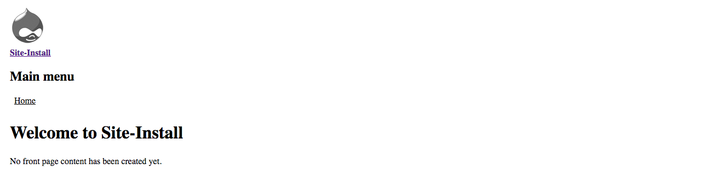
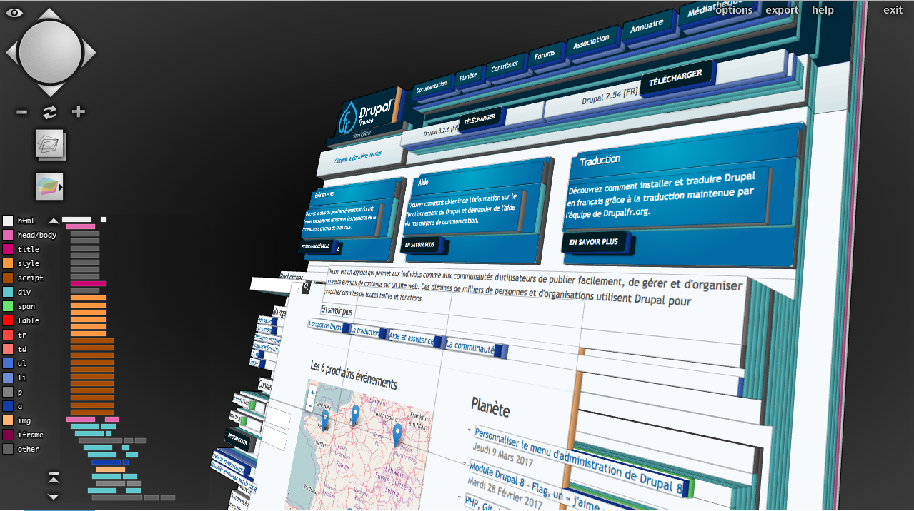
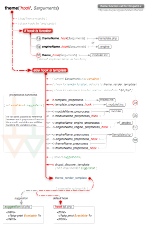

# Drupal 7 : theming

---

# Programme

1. Introduction
    * Présentation de Drupal, des outils de développement

2. HTML / CSS généré par Drupal
    * Analyse et vue d'ensemble des fichiers d'un thème
    * Templates, Thèmes et Modules
    * Analyse du HTML/CSS généré par Drupal

3. Créer son premier squelette de thème

4. Introduction au Responsive Web Design
    * Breakpoints
    * Omega et Zen
    * Bootstrap

--------------------------------------------------------------------------------

# Introduction

---

## Présentation de Drupal

Drupal est très flexible au niveau de l'apparence :

  - possibilité d'avoir plusieurs thèmes dans une installation
  - différence thème front / thème d'administration
  - possibilité d'avoir un front full JS (React, Angular)

Drupal est très flexible avec beaucoup de modules et autant de concepts, d'API,
de façons de travailler. 

Préparez-vous : votre cerveau va chauffer !

---

## Outils de développement

### Installation du serveur web

WAMP, MAMP, XAMPP selon votre OS...

### Installation d'un éditeur

SublimeText, VScode, PHPStorm, selon vos affinités...

### Utilisation de Firefox/Chrome

Du moment que celui-ci permet d'inspecter le CSS, le JS, les requêtes réseau...

---

## Les différents concepts de Drupal

  - __Les nœuds__ 
Le principe au cœur de Drupal depuis sa naissance
  - __Les types de contenu, les champs, et les modes d'affichage__ 
Ce qui permet de structurer le contenu
  - __Les entités (node, user, taxonomy_term)__ 
Drupal n'est pas que du contenu
  - __Les menus__ 
Construire l'arborescence de liens vers les pages
  - __Les vues__ 
Construire des requêtes pour afficher des objets
  - __Les blocs et les régions__ 
Structurer les différents éléments sur une page

Il faut plonger dans sa mémoire ou demander au formateur `;)`

--------------------------------------------------------------------------------

# Exercice : Installer Drupal, créer un type de contenu avec quelques champs

.fx: alternate

--------------------------------------------------------------------------------

# Les principes fondamentaux

---

## Le module est la source

> Le balisage est toujours fourni en premier lieu par un module, le thème ne
> fait que surchager ce balisage avec du CSS.

Pour illustrer ce principe, activer le thème Stark.

Un thème aura toujours le dernier mot, mais la phrase ne sera peut-être pas
forcément complète.

---

## Une structure arborescente

> Le balisage d'une page est constitué d'élements imbriqués et se construit
> de l'élément le plus profond pour remonter vers l'élément englobant

Pour illustrer ceci, utiliser _Tilt 3D_ (extension de Firefox).

--------------------------------------------------------------------------------

# Création d'un thème

---

## L'arborescence de fichiers

Dans le dossier `sites/all/theme/montheme`, on doit avoir sensiblement

- `montheme.info` : _Informations de base sur le thème (nom, régions, assets, etc.)_
- `screenshot.png` : _Prévisualitation pour l'administration des thèmes_
- `favicon.ico` : _Favicon par défaut_
- `template.php` : _"Metier" du thème_
- `templates/` : _dossier de stockage des templates_
- `css/` : _stockage des CSS (peut avoir `less` ou `sass` en plus)_
- `js/` : _stockage des JS (peut avoir `dist` en plus)_

Le nommage des dossiers n'est pas fixe mais constitue une bonne pratique.

__Où travailler ?__

Dans le dossier `sites/all/themes` (et nul part ailleurs !)

---

## Le fichier .info

    !ini
    name = Mon theme 
    description = A slick theme design 
    core = 7.x
    base theme = boostrap
    
    # Assets
    stylesheets[all][] = style.css
    stylesheets[print][] = print.css
    scripts[] = monscript.js
    
    # Régions
    regions[header] = Header 
    regions[content] = Content 
    regions[sidebar] = Sidebar 
    regions[footer] = Footer 

- Le `base theme` permet d'hériter des templates et preprocess d'un autre thème.
- Les assets seront ajoutés sur chaque page où ce thème est affiché (peu 
performant)
- Les régions sont optionnelles (7 régions par défaut) et permettront de placer
les blocs dans ce thème

Plus d'informations dans la [documentation](https://www.drupal.org/node/171205) 

--------------------------------------------------------------------------------

# Exercice : créer et activer un thème

.fx: alternate

--------------------------------------------------------------------------------

# Dans les boyaux de Drupal

---

## Le hook_theme()

Ce hook est au cœur du mécanisme de theming, chaque module peut l'implémenter.

Chaque module peut ainsi proposer des implémentations de thème (fonction ou 
template) pour afficher les données qu'il traite.

La rapidité d'un thèmeur s'acquiert donc avec l'expérience car il doit connaitre
à peu près toutes les implémentations de thème du coeur et des modules les plus 
utilisés.

On trouve donc deux manières de fournir du balisage : une fonction ou un 
template, le plus pratique étant le template.

    !php
    function node_theme() {
      return array(
        'node' => array(
          'render element' => 'elements',
          'template' => 'node',
        ),
        'node_recent_content' => array(
          'variables' => array('node' => NULL),
        ),
      );
    }

---

## L'affichage d'un élément

Pour afficher un noeud (par exemple), il y a deux moyens.

### • Soit la fonction `theme()`

    !php
    $html = theme('node', ['node' => $node]);

Ne permet pas l'atération, est "calculé" à l'appel

### • Soit un render array

    !php
    $build = array(
       '#theme' => 'node',
       '#node' => $node,
    );
    $html = render($build);

Permet l'altération des propriétés, l'imbrication de sous-éléments

Plus d'informations dans la 
[documentation](https://www.drupal.org/docs/7/api/render-arrays/render-arrays-overview)

---

## Le processus d'affichage

Il y a plusieurs niveaux où surcharger le balisage ou les propriétés pour chaque 
implémentation (_theme hook_).  

[Version PDF](https://www.drupal.org/files/theme_flow_6_1.pdf) et 
[plus d'informations](https://www.drupal.org/docs/7/theming/overriding-themable-output/about-overriding-themable-output)

---

## Comment surcharger ?

1. Trouver le module qui fournit l'implémentation (Ctrl+F ou préfixes)
2. Trouver le nom de l'implémentation
3. Vérifier si c'est une fonction ou un template

__Je veux travailler sur les données ?__

- Déclarer un `montheme_preprocess_sonimplementation(&$vars)` 
ou `montheme_process_sonimplementation(&$vars)`

__Je veux modifier le balisage ?__

- Pour une fonction : `montheme_sonimplementation()` 
  Pour un template : `son-implemenation.tpl.php` ou une suggestion dans mon 
  thème
- Copier-coller le code de la fonction ou du template et commencer à modifier

---

## Les preprocess et process

Ces fonctions sont utilisées pour traiter les arguments donnés à un render array.
Elles peuvent donc appeler d'autres implémentations de thème et décomposer
en plusieurs sous-éléments.

Par exemple, on pourrait penser à un blog de cette manière :
 
    !php
    $build = [
      '#theme' => 'blog',
      '#posts' => $posts, 
    ];
    
    function montheme_preprocess_blog(&$vars) {
      $vars['list'] = node_view_multiple($vars['posts'], 'blog_post');
    }

--------------------------------------------------------------------------------

# Exercice : surcharger le balisage d'un noeud

.fx: alternate

--------------------------------------------------------------------------------

# Les theme engines

---

## PHPTemplate

C'est le theme engine par défaut de Drupal, et aussi le plus simple. 
Les variables sont passées dans un fichier php qui est exécuté.
C'est aussi le plus verbeux, le moins lisible, et le moins sécurisé !

    !html+php
    <?php if ($header): ?>
      

        <?php print $header; ?>
      

    <?php endif; ?>
    <?php if (!empty($title)): ?>
      <h2><?php print $title; ?></h2>
    <?php endif; ?>
    
Il faut éviter d'appeler des fonctions dans ces templates, et préférer 
l'utilisation de preprocess.

L'extension utilisée est `.tpl.php`

---

## Twig

Ce language de templating est utilisé dans Drupal 8, et backportable dans 
Drupal 7 à travers le theme engine [TFD7](https://tfd7.rocks/).
Il est sécurisé, extensible, et surtout facile à écrire et lisible.

    !html+twig
    
      

        {{ header }}
      

    
    
      <h2>{{ title }}</h2>
    

Il contraint le thèmeur, mais est tellement puissant qu'on ne lui en veut pas.

Son extension par défaut est `.tpl.twig`

[Documentation](http://twig.sensiolabs.org)

---

## Standards de code

Pour que tout le monde puisse lire tout le monde:

 * [PHPTemplate](https://www.drupal.org/docs/7/theming/tools-and-best-practices/theme-coding-conventions)
 * [Twig](https://www.drupal.org/node/1823416)
 * [JavaScript](https://www.drupal.org/node/172169)
 * [CSS](https://www.drupal.org/node/1886770)
 * [PHP](https://www.drupal.org/docs/develop/standards/coding-standards)

--------------------------------------------------------------------------------

# Exercice : Convertir le thème en twig

.fx: alternate

--------------------------------------------------------------------------------

# La suite

  - Les preprocess
  - Afficher les variables avec devel ou Xdebug
  - Les suggestions de theme
  - Ajout de CSS/JS
  - Themer un formulaire
  - Modules affectant la présentation
    - panels
    - display suite
    - comment reconaitre un template
    - etc.
  - Sécurité
  - L'héritage de themes
  - Themes de base (bootstrap, mothership, zen, basic, genesis)
  - Themes frameworks (omega, adaptive, framework)
  - Les hooks à connaitre (custom theme, css/js_alter)
  - Le SEO
  - Le cache

---

# Des questions ?
