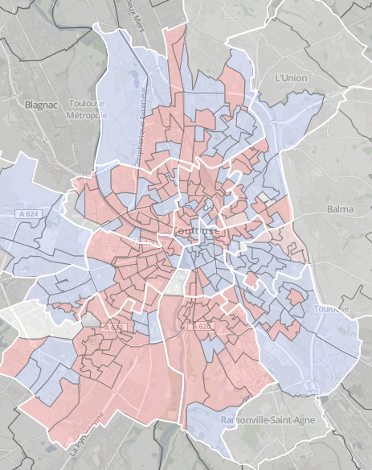
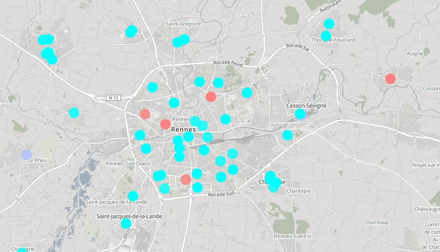
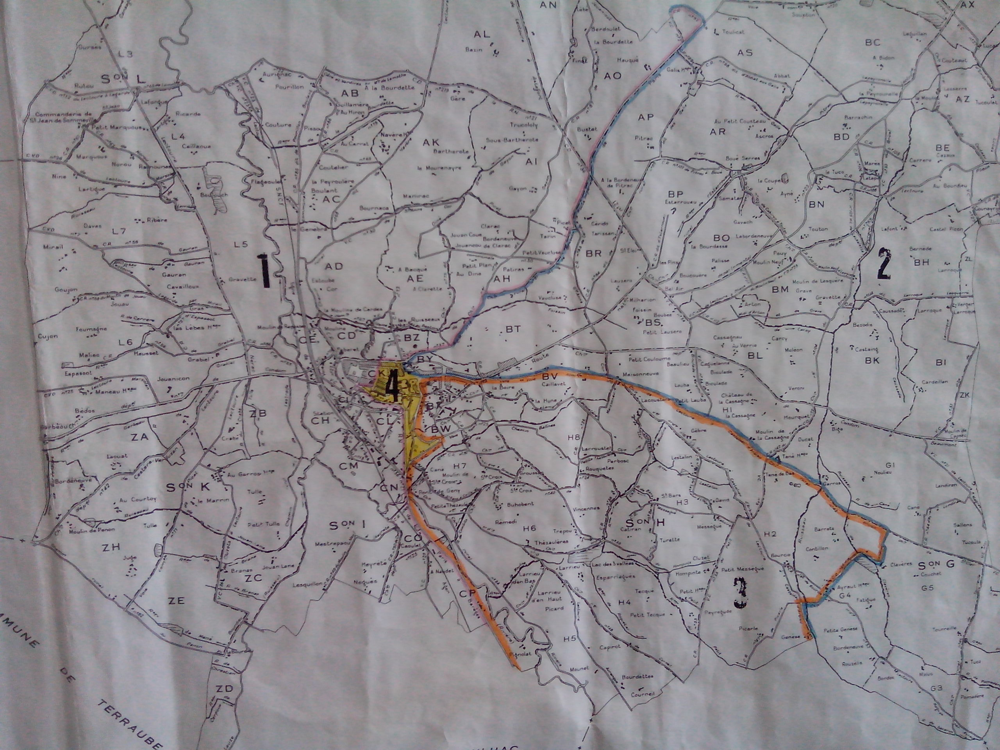

# Open Data,
# cartographie et 
# élections

.fx: extra-large

--------------------------------------------------------------------------------

# Objectif

## Réaliser une carte interactive des résultats des élections régionales de décembre 2015 pour chacun des bureaux de vote en France

.fx: alternate
.fx: extra-large
.notes: cela semble assez simple...

--------------------------------------------------------------------------------

# Données ouvertes et élections : quel intérêt ?
Favoriser l'action citoyenne

  * Mettre à la disposition du plus grand nombre les données les plus précises possibles
  * Permettre la création d'outils pour explorer les données

.fx:larger

.notes: Permettre d'explorer les votes au niveau le plus détaillé possibles, dès le soir des élections, croiser avec d'autres données

--------------------------------------------------------------------------------

# Qui peut bénéficier de meilleures informations ?
  * citoyens
  * journalistes
  * pouvoirs publics
  * analystes politiques
  * chercheurs
  * partis politiques, militants
  * ...

.fx: larger
.notes: De nombreux publics sont intéressés et demandeurs (exemple des parties politiques qui nous ont demandé des cartes par parti lors des municipales de 2014)

--------------------------------------------------------------------------------

# Rappel du fonctionnement – avant les élections
  * Les électeurs s'inscrivent sur les **listes électorales**
  * Un **bureau de vote** leur est attribué en fonction de leur adresse
  * Un **lieu de vote** est associé à chaque bureau de vote

.fx: extra-large

--------------------------------------------------------------------------------

# Rappel du fonctionnement – après le vote
  * Dans chaque bureau de vote les suffrages pour les différentes listes sont reportés sur un procès-verbal
  * Le soir de l'élection, les PV sont transmis par les communes à leur préfecture
  * Les préfectures remontent les informations au ministère de l'Intérieur
  * La préfecture diffuse en temps réel les informations à des représentants de la presse
  * Le ministère de l'Intérieur transmet les résultats définitifs à la presse puis au public

.notes: seules les transmissions des préfectures au ministère sont standardisés. communes vers préfectures : télétransmission par logiciel, email, téléphone... préfectures vers journalistes : papier ?

--------------------------------------------------------------------------------

# Les données

.fx: extra-large
.fx: alternate

--------------------------------------------------------------------------------

# Les données intéressantes

  * listes électorales
  * listes de candidats : n°, noms des candidats, nuance politique, circonscription d'élections
  * définition des bureau de vote : soit contour soit liste des voies
  * éventuellement lieu de vote
  * résultats au niveau des bureaux de vote

.fx: extra-large

--------------------------------------------------------------------------------

# Où trouver les listes de candidats ?
Liste du 1er tour déposées du 2 au 9/11
Liste du 2nd tour déposées du 7 au 8/12

Probablement publiées sur elections.interieur.gouv.fr 
   quelques heures après clôture des dépôts 
      sous forme de pages web difficiles à exploiter

Probablement publiées sur www.data.gouv.fr 
   quelques heures après clôture des dépôts 
      en xls

Il n'y a cependant pas de certitudes
Pb : difficile de connaître les modes de diffusion et le format avant la publication

.notes: Le ministère de l'Intérieur a public les listes rapidement lors des précédentes élections.

--------------------------------------------------------------------------------

# Forme de l'information "bureaux de vote"
Les bureaux de vote sont définis dans des arrêtés préfectoraux 
Article L17 du code électroral « A chaque bureau de vote est affecté un périmètre géographique ».

Des modes de définitions variés :

  * listes de voies composant le périmètre du bureau
  * listes exhaustive des voies comprises dans le bureau
  * contours tracés sur des cartes

--------------------------------------------------------------------------------

# Où trouver les contours des bureaux de vote ?

Disponibles sur demande auprès de chaque préfecture, parfois sur le site web.

Aucune format de diffusion standard :

  * Souvent livrés en pdf voire pdf d'un document scanné
  * Beaucoup d'énergie nécessaire pour obtenir les fichiers dans un format réutilisable
  * Aucune préfecture ne diffuse un vrai document réutilisable

Toujours des bureaux de vote changés entre chaque élection
Démarches à renouveler à chaque fois

--------------------------------------------------------------------------------

# Où trouver les résultats ?

* Résultats locaux disponibles dans les bureaux de vote : impose d'être présent
* Résultats à l'échelle du département disponibles dans les préfectures, le soir de chaque tour.
    * _mais_ diffusés seulement auprès de la presse, manuellement (pas d'API)
    * _résutats fournis par commune, pas par bureaux de vote_
* Résultats à l'échelle nationale disponibles auprès du min. de l'Intérieur au fur et à mesure de la validation :
    * API destinée à la presse
    * diffusion sur le site du Ministère, délai important

.notes: (Le ministère procédant à des vérifications, ses résultats sont publiés tardivement) (La presse récupère les résultats en préfecture quitte à corriger en cas d'erreur. (Le ministère publie les résultats à des niveaux aggrégés par commune) Innovation 2015 : le Min a publié sur data.gouv.fr les résultats par BV début octobre 2015, plusieurs mois après les élections. Peut-on espérer une publication plus rapide pour les Régionales ?

--------------------------------------------------------------------------------

# Quelques initatives Open Data isolées
  * Certaines villes publient les définitions des bureaux de vote ainsi que les résultats en open data (Toulouse, Nantes, Rennes, Montpellier...)
  * Ces publications sont souvent rapides (lendemain) mais pas assez pour la presse.
  * Cependant, les formats sont différents d'une ville à l'autre…
  * Problème de pertinence de la zone publiée par rapport aux circonscriptions électorales

.notes: au sein d'une même circonscription électorale, il peut y avoir des données publiées et d'autres pas. Pour les départementales, des cantons sont à cheval sur des villes open data et sur des villes muettes.

.fx:larger

--------------------------------------------------------------------------------

# Toulouse

.notes: dans le canton du sud-est de l'agglomération, Ramonville-Saint-Agne ne publie pas.

--------------------------------------------------------------------------------

# Rennes

--------------------------------------------------------------------------------

# Fougères

--------------------------------------------------------------------------------

# Exemples de diffusion Open Data
  * _Nantes_ : 
"BUREAU_DE_VOTE","INSCRITS","PROCURATIONS","VOTANTS","NULS","EXPRIMES","AUBRY-COLOBERT","DANIS-PADOVANI","GOUGEON-LADRET","FOURNIER-GUERRA","DE-RIGNE-DRICI","DAGUET-FAVENNEC","ASSELIN-AZZI" 
"111-Ecole Maternelle "Molière"","920","18","440","2","431","25","120","66","129","43","35","13"
  * _Toulouse_ : 
sequence_increment;type_election;année;tour;département;commune;bv;canton;circonscription; Initial/Rectifié;inscrits;abstention;votants;votants_émargement;bulletins_blancs;bulletins_nuls; bulletins_exprimés;nbr_liste;liste_A;nbr_voix_liste_A;liste_B;nbr_voix_listeB 
2;DP;2015;2;31;555;155;16;1;I;979;550;429;429;18;10;401;2;62;241;137;160
  * _Rennes_ : 
CODE_ELECTION;NOM_ELECTION;NUMERO_TOUR;DATE_ELECTION;NIVEAU_DETAIL;NUMERO_LIEU;NOM_LIEU; ADRESSE_LIEU;NUMERO_CANTON;NOM_CANTON;NUMERO_CIRCONSCRIPTION;NOM_CIRCONSCRIPTION; NB_INSCRITS;NB_EMARGEMENTS;NB_BULLETINS;NB_BLANCS;NB_NULS;NB_EXPRIMES;POURCENTAGE-PARTICIPATION;VALID;CANDIDATS_1;NB_VOIX_1;POURCENTAGE_1;CANDIDATS_2;NB_VOIX_2;POURCENTAGE_2 
D15;ELECTIONS DEPARTEMENTALES 2015;2;20150329;bu;111;Groupe Scolaire Echange;;1;RENNES-1;8;8ème circonscription;1051;442;442;18;12;412;42,06;O;Mme DHALLUIN Amélie et M. LE BOUEC Philippe (UMP-UDI);133;32,28;M. HERVE Marc et Mme ROUSSET Emmanuelle (PS-PRG);279;67,72

.fx: tp

--------------------------------------------------------------------------------

# Quelques bons élèves... et d'autres

<TABLE>
<THEAD>
<TR><TH>Ville</TH><TH>Découpage</TH><TH>Résultats</TH></TR>
</THEAD>
<TBODY>
</TR><TR style="color: #FF0000;"><TD>Toulouse</TD><TD>GeoJSON</TD><TD>CSV (dès le lundi matin)</TD>
</TR><TR><TD>Nantes</TD><TD>Shapefile & KML</TD><TD>CSV (par canton)</TD>
<TR><TD>Rennes</TD><TD>Points, puis polygones Shapefile</TD><TD>CSV</TD>
</TR><TR><TD>Montpellier</TD><TD>GeoJSON</TD><TD>CSV (plus tard)</TD>
</TR><TR><TD>Marseille</TD><TD>Pas de plate-forme</TD><TD>Pas de plate-forme</TD>
</TR><TR><TD>Lille</TD><TD>Pas de plate-forme</TD><TD>Pas de plate-forme</TD>
</TR><TR><TD>Poitiers</TD><TD>Pas de plate-forme</TD><TD>Sur data.gouv.fr</TD>
</TR>
</TBODY>
</TABLE>

.fx: tp

--------------------------------------------------------------------------------

# Conclusion
Informations électorales au niveau national :

* incomplètes
* publiées tardivement
* difficiles d'accès
    * formats disparates
    * publiées à de trop nombreux endroits différents
    * exigent de bonnes compétences techniques

.fx: extra-large

--------------------------------------------------------------------------------

# Conclusion (suite)
Dans les faits, les informations au niveau du bureau de vote sont difficilement exploitables dans la majorité des cas.
Travail manuel demandé trop intensif ; à recommencer à chaque élection

En octobre 2015, la situation est déplorable

  * toujours pas de visualisations proposées
  * contours SIG des bureaux de vote majoritairement indisponibles
  * pas d'API REST
  * pas d'historiques

Ces données sont censées être publiques.
Pourtant, beaucoup de temps perdu, des refus, des incompréhensions
Impossible de faire des représentations des résultats bureau par bureau, rapidement et automatiquement !
Impossible de réaliser des analyses d'évolutions historiques

.notes: les informatoins sont complètes par commune, pas par bureau de vote / Mauvaise volonté dans la diffusion des bureaux de votes ? / Le service XML du min est une plaisanterie

--------------------------------------------------------------------------------

# Exploitation des données lors de précédentes élections

.fx: alternate

--------------------------------------------------------------------------------

# Recherche des listes de candidats
  * data.gouv.fr
  * Quelques retraitements pour trouver les [définitions des couleurs](http://fr.wikipedia.org/wiki/Mod%C3%A8le:Infobox_Parti_politique/couleurs)

# Recherche des contours des bureaux de vote

Pas de centralisation des informations.

Chercher sur :

  * data.gouv.fr
  * site Open Data des villes
  * contacter les villes une par une
  * récupérer des données en préfecture

------------------------------------------------------------------------------

# Fichier SIG des bureaux de vote

Quelques villes fournissent les contours dans un format géomatique sous forme de fichier à télécharger:

  * Rennes (non publiés à l'époque de l'élection (oubli)) :

    - DXF / DWG en L93, CC48, WGS84
    - KML
    - SHP en  en L93, CC48, WGS84

  * Toulouse :

    - GeoJSON, Shapefile (WGS84)

  * Nantes :

    - SHP, KMZ

.notes: fichiers shp ou GeoJSON, faciles à traiter (mais traitements nécessaires selon la projection / le format, ou tout simplement pour optimiser le fichier...)

------------------------------------------------------------------------------

# Image du périmétre des bureaux de vote

Certains villages ont transmis un dessin ou une photo de la carte papier du périmétre

.notes: traitement manuel pour créer le contour dans un format SIG

------------------------------------------------------------------------------

# Travaux de création des fichiers SIG des bureaux de vote

--------------------------------------------------------------------------------

# Recherche des résultats par bureaux de vote
Pas de centralisation disponible

Parfois :

  * site des villes
  * certaines villes publient sur data.gouv.fr
  * contacter les villes une par une
  * envoi (journalistes les ayant obtenus en préfectures)

.fx: larger

------------------------------------------------------------------------------

# Nettoyage, formatage, normalisation… des résultats

"Resultats": {"NuancesBin": {"NuanceBin": [{"CodNuaBin": "BC-COM", "LibNuaBin": "Bin\u00f4me du Parti communiste fran\u00e7ais", "NbVoix": "7339", "RapportExprime": "3,86", "RapportInscrit": "1,82", "NbElus": "0"}, {"CodNuaBin": "BC-UG", "LibNuaBin": "Bin\u00f4me Union de la Gauche", "NbVoix": "48876", "RapportExprime": "25,69", "RapportInscrit": "12,14", "NbElus": "0"}, {"CodNuaBin": "BC-DVG", "LibNuaBin": "Bin\u00f4me Divers gauche", "NbVoix": "566", "RapportExprime": "0,30", "RapportInscrit": "0,14", "NbElus": "0"}, {"CodNuaBin": "BC-VEC", "LibNuaBin": "Bin\u00f4me d'Europe-Ecologie-Les Verts", "NbVoix": "7228", "RapportExprime": "3,80", "RapportInscrit": "1,80", "NbElus": "0"}, {"CodNuaBin": "BC-DIV", "LibNuaBin": "Bin\u00f4me Divers", "NbVoix": "261", "RapportExprime": "0,14", "RapportInscrit": "0,06", "NbElus": "0"}, {"CodNuaBin": "BC-UMP", "LibNuaBin": "Bin\u00f4me Union pour un Mouvement Populaire", "NbVoix": "5059", "RapportExprime": "2,66", "RapportInscrit": "1,26", "NbElus": "0"}, {"CodNuaBin": "BC-UD", "LibNuaBin": "Bin\u00f4me Union de la Droite", "NbVoix": "64928", "RapportExprime": "34,13", "RapportInscrit": "16,13", "NbElus": "0"}, {"CodNuaBin": "BC-DVD", "LibNuaBin": "Bin\u00f4me Divers droite", "NbVoix": "3024", "RapportExprime": "1,59", "RapportInscrit": "0,75", "NbElus": "0"}, {"CodNuaBin": "BC-FN", "LibNuaBin": "Bin\u00f4me Front National", "NbVoix": "52981", "RapportExprime": "27,85", "RapportInscrit": "13,16", "NbElus": "0"}]}}

.notes: format uniforme contenant toutes les données, notamment la nuance de couleur, ainsi que tous les chiffres pour effectuer les calculs si besoin.

------------------------------------------------------------------------------

# Création d'une bibliothèque JavaScript : election.js

  * 1 seul fichier JavaScript
  * Extrait toute la technique (création de la carte, tri des candidats, choix de la couleur...)
  * Deux données à lui fournir :
    * le découpage (format GeoJSON, WGS84)
    * l'algorithme de récupération des données en fonction du fichier de résultats  (dépendant de l'élection)
  * Voir l'[article de blog](http://makina-corpus.com/blog/metier/2015/elections-js-genere-des-cartes-pour-vous)
  * Permet d'obtenir une carte des résultats en ~ 1h

--------------------------------------------------------------------------------

# Exemple de résultats obtenus

.fx: tp

--------------------------------------------------------------------------------

# Ce que font les autres

<iframe src="http://labs.letemps.ch/interactive/2015/carte-udc/" style="width:100%;height:550px;"></iframe>

.fx: tp

--------------------------------------------------------------------------------

# Conclusion

Cartes réalisées pour quelques villes seulement car la recherche et le traitement de données sont coûteux en temps

Selon l'état des données, il faut une heure à plus d'une journée de travail pour la carte d'une ville.

De plus, la majorité des données ne sont pas disponibles.

.fx: extra-large

--------------------------------------------------------------------------------

# Les initiatives pour faire bouger la situation

.fx: alternate

--------------------------------------------------------------------------------
# Initiatives nationales pour les bureaux de vote
Programme de recherche Cartelec 

* Construction des contours des bureaux de vote des villes principales
* Résultats incomplets : milieu rural, villes de moins de 100 000 habitants
* Plus à jour depuis au moins 2012
* Dépassé techniquement 

Regards Citoyens

* tentative de contribution collaborative
* abandon

.fx: alternate
.fx:larger
.notes :Pas mis à jour car fruit d'un travail manuel.

------------------------------------------------------------------------------
# Initiatives nationales pour les résultats
Ministère de l'Intérieur 

* Publication en octobre 2015 des résultats par bureaux de vote
* En temps réel aux prochaines élections ?

------------------------------------------------------------------------------
# Rappel de l'Objectif
** Créer une carte interactive des résultats des élections régionales de décembre 2015 pour chacun des bureaux de vote en France**

C'est un travail titanesque requérant des ressources et des budgets importants.

Échec

.fx:larger
.fx: alternate

--------------------------------------------------------------------------------

# Discussion

> Comment faire mieux ?
