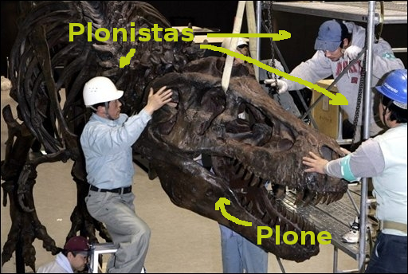

# Why CMS won't die
## Éric Bréhault - PloneConf 2014

.fx: extra-large

--------------------------------------------------------------------------------

# This is about future

100% guaranteed

.fx: extra-large

--------------------------------------------------------------------------------

# Our world: the web

**Something new every minute!!**

.fx: extra-large

--------------------------------------------------------------------------------

# All the CMS are old

- Typo3: 1997
- Drupal: 2001
- Plone: 2002
- Wordpress: 2003
- Joomla!: 2005 (forked from Mambo: 2000)

.fx: extra-large

--------------------------------------------------------------------------------

# Not that old

because CMS are still alive.

.fx: extra-large

--------------------------------------------------------------------------------

# Sometimes that old

- Elegant
- Super-hard to move
- Not 100% compliant with modern comfort standards

.fx: extra-large

--------------------------------------------------------------------------------

# Mostly that old

Grumpy but sharp!

.fx: extra-large

--------------------------------------------------------------------------------

# No newcomers

# Nobody knows about CMS but us (CMSistas)

# CMS is huge project

# Users still needs CMS badly

# Wordpress = 60%
100% ? no way
never saw any WP at any of my customers

# Nobody promises it will be easy
Is Plone too complex to survive?
All CMS are complex

We are good at some points (eg: Drupal still not on github)

--------------------------------------------------------------------------------
# Thank you!