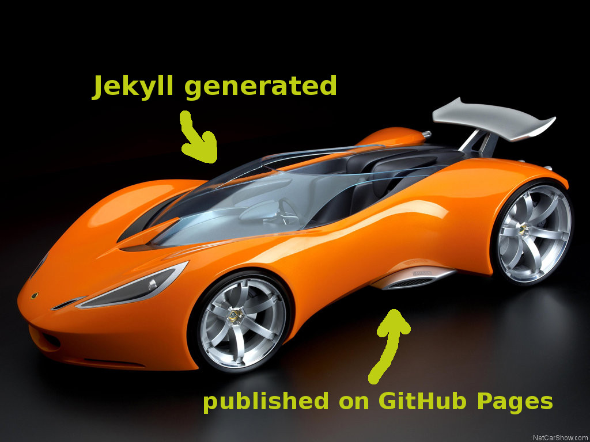
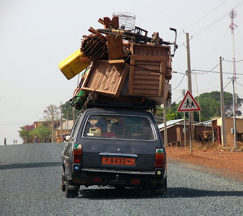
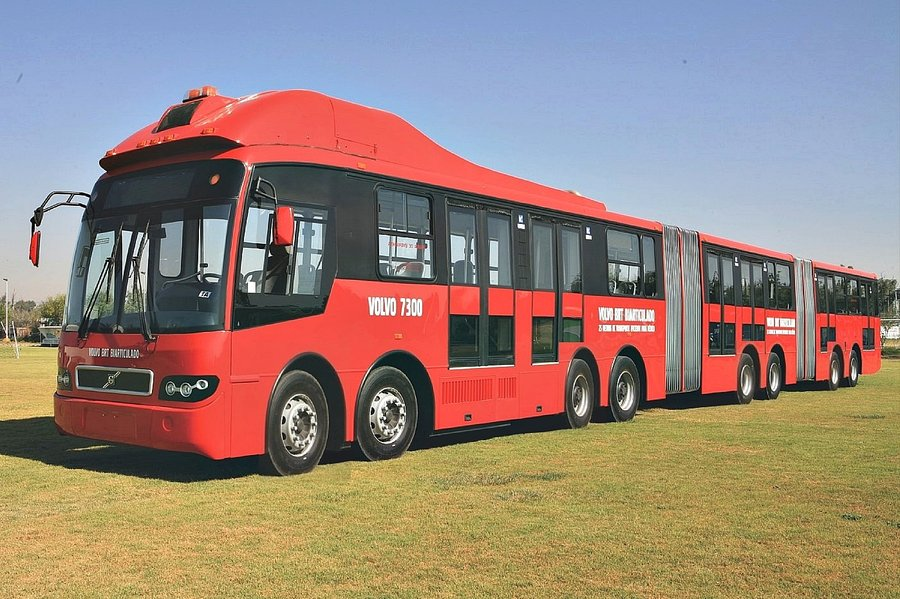

# Why CMS won't die
## Éric Bréhault - PloneConf 2014

.fx: extra-large

--------------------------------------------------------------------------------

# Our world: the web

**Something new every minute!!**

.fx: extra-large

--------------------------------------------------------------------------------

# All the CMS are old

- Typo3: 1997
- Drupal: 2001
- Plone: 2002
- Wordpress: 2003
- Joomla!: 2005 (forked from Mambo: 2000)

.fx: extra-large

--------------------------------------------------------------------------------

# Not that old

because CMS are still alive.

.fx: extra-large

--------------------------------------------------------------------------------

# Sometimes that old

- Elegant
- Super-hard to move
- Not 100% compliant with modern comfort standards

.fx: extra-large

--------------------------------------------------------------------------------

# Mostly that old

Grumpy but sharp!

.fx: extra-large

--------------------------------------------------------------------------------

# But we keep them

**BECAUSE USERS NEED CMS!!!**

.fx: extra-large

--------------------------------------------------------------------------------

# OK, no-CMS is possible

At the beginning, users probably just want to edit few pages.

.fx: extra-large

--------------------------------------------------------------------------------

# But...

They will also need to manage medias.

.fx: extra-large

--------------------------------------------------------------------------------

# But...

A validation workflow would be nice.

.fx: extra-large

--------------------------------------------------------------------------------

# But...

Hence we have to manage access rights.

.fx: extra-large

--------------------------------------------------------------------------------

# But...

Newsletter is a must-have

.fx: extra-large

--------------------------------------------------------------------------------

# But...

Plus a document sharing restricted area.

.fx: extra-large

--------------------------------------------------------------------------------

# But...

Multilingual.

.fx: extra-large

--------------------------------------------------------------------------------

# But...

Subsites, which are all identical but 2 or 3 things.

.fx: extra-large

--------------------------------------------------------------------------------

# Next thing you know...

.fx: extra-large

--------------------------------------------------------------------------------

# Face it, you need a CMS

.fx: extra-large

--------------------------------------------------------------------------------

# And there will be no young newcomers

.fx: extra-large

--------------------------------------------------------------------------------

# because CMS are special

Nobody knows about CMS but us (CMSistas)

.fx: extra-large

--------------------------------------------------------------------------------

# because CMS are huge projects

It cannot be managed and developed just like any project.

Example: who needs `buildout` in Python but us?

.fx: extra-large

--------------------------------------------------------------------------------

# Wordpress = 60%

100% tomorrow? No way!

Never saw any WP at any of my customers.

.fx: extra-large

--------------------------------------------------------------------------------

# Nobody promises it will be easy

Is Plone too complex to survive?

**All CMS are complex**

.fx: extra-large

--------------------------------------------------------------------------------

# Recipe to survive?

My 2 cents:

- make it always more **usable**,
- clear **frontend / backend** dichotomy.

.fx: extra-large

--------------------------------------------------------------------------------

# Thank you!