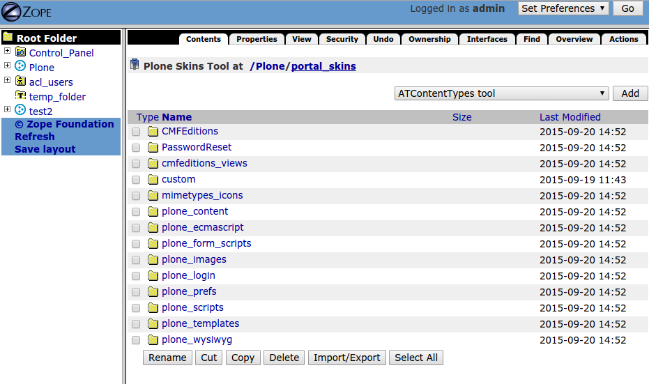
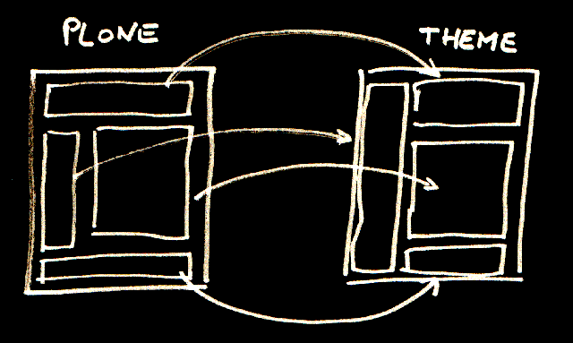
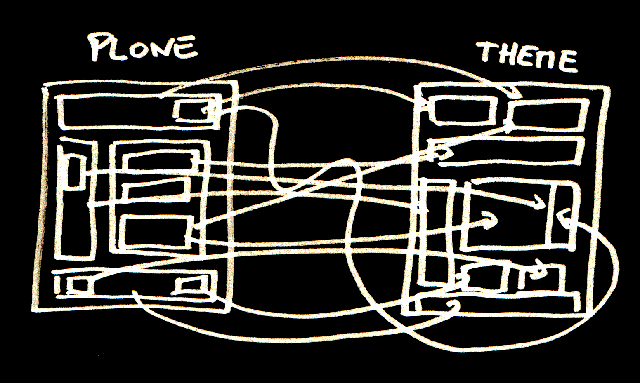
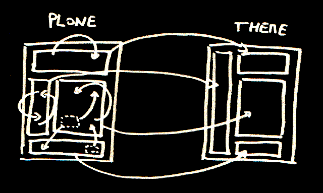

# Happy hacking with Plone
## Éric Bréhault - PloneConf 2015

.fx: extra-large

--------------------------------------------------------------------------------

# We, Plone developers

- invest time in Plone,
- build something nice and attractive,
- feel pround of it.

.fx: extra-large

--------------------------------------------------------------------------------

# We, Plone developers

<!--<video src="video/architect.mp4" poster="none.jpg" width="70%" controls="true"></video>-->

from "Les Vacances du Petit Nicolas" by Laurent Tirard

.fx: extra-large
--------------------------------------------------------------------------------

# The users

from "Les Vacances du Petit Nicolas" by Laurent Tirard

.fx: extra-large

--------------------------------------------------------------------------------

# The users play

<!--<video src="video/users.mp4" poster="none.jpg" width="70%" controls="true"></video>-->

from "Les Vacances du Petit Nicolas" by Laurent Tirard

.fx: extra-large

--------------------------------------------------------------------------------

# The conflict

- They loved it.
- We are desperate.

.fx: extra-large

--------------------------------------------------------------------------------

# We retaliate

.fx: extra-large

--------------------------------------------------------------------------------

# Pharmakon

φάρμακον: medecine, drug, poison

**Any medecine is also a poison.**

.fx: extra-large

--------------------------------------------------------------------------------

# My solution

.fx: extra-large

--------------------------------------------------------------------------------

# Hackability is a feature

It is **not** a flaw.

It must be **provided as a tool**.

.fx: extra-large

--------------------------------------------------------------------------------

# A hacking tool...

- to change or add whatever we want in our Plone site
- through a modern and pleasant web interface

# ... not a hackable system

.fx: extra-large

--------------------------------------------------------------------------------

# ZMI?

.fx: extra-large

--------------------------------------------------------------------------------

# The Plone Theming editor!

Already a "hacking" tool:

**non-Plone experts can change the entire theme**.

.fx: extra-large

--------------------------------------------------------------------------------

# Diazo theory

**"We Write XSLT, So You Don't Have To"**

.fx: extra-large

--------------------------------------------------------------------------------

# Diazo reality

**Guess what? I am writing tons of XSLT!!**

.fx: extra-large

--------------------------------------------------------------------------------

# What we need

.fx: extra-large

--------------------------------------------------------------------------------

# Content-to-content 

On-the-fly content changes with `<before/>` and `<after/>`.

    !xml
    <before css:content="#content-core">
        <a href="mailto:contact@diazo.org">
            Ask for help
        </a>
    </before>

.fx: extra-large

--------------------------------------------------------------------------------

# Content-to-content 

On-the-fly content insertion.

    !xml
    <before css:content-children="#main">
        <include css:content="#breadcrumbs" />
    </before>

.fx: extra-large

--------------------------------------------------------------------------------

# Content-to-content 

On-the-fly remote content insertion.

    !xml
    <before css:content-children="#main">
        <include href="/news"
            css:content="#breadcrumbs" />
    </before>

.fx: extra-large

--------------------------------------------------------------------------------

# We want more 

- create our own chuncks of content
- implement our own scripts

## with basic knowledge of **HTML and Python**

.fx: extra-large

--------------------------------------------------------------------------------

# Rapido

.fx: extra-large

--------------------------------------------------------------------------------

# It lives in the theme 

- Editable **through the Plone interface**...
- ...or **in the sources**.
- We use **Diazo** to inject it in Plone.

.fx: extra-large

--------------------------------------------------------------------------------

# Dead simple 

- no ZCA stuff,
- no ZPT (or any templating language),
- no JBOT,

## Just HTML and Python

.fx: extra-large

--------------------------------------------------------------------------------

# Demo

.fx: extra-large

--------------------------------------------------------------------------------

# What do we get in our context?

- `context.app`
- `context.request`
- `context.portal`
- `context.content`
- `context.api` (the Plone API!!)

.fx: extra-large

--------------------------------------------------------------------------------

# Is it secure?

Python scripts are executed by `zope.security.untrustedpython`.

All the regular security stack is applied, like:

- current user privileges,
- CSRF policy (`@PostOnly` for instance).

.fx: extra-large

--------------------------------------------------------------------------------

# Battery included

Rapido comes with a complete **REST API**.

GET / POST / DELETE / PUT / PATCH

It is a **ready-to-use JSON backend**.

.fx: extra-large

--------------------------------------------------------------------------------

# Demo

.fx: extra-large

--------------------------------------------------------------------------------

# Battery included

Rapido provides a **Plone Content Rules action**.

We can hook our scripts to **any Plone event**.

.fx: extra-large

--------------------------------------------------------------------------------

# Battery included

Rapido is **Mosaic compliant**.

(but it does not depend on it)

.fx: extra-large

--------------------------------------------------------------------------------

# Demo

.fx: extra-large

--------------------------------------------------------------------------------

# Thank you!

.fx: extra-large

--------------------------------------------------------------------------------

