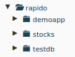
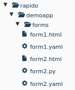

# Empowering users

.fx: extra-large

--------------------------------------------------------------------------------

# We have a powerful theming editor

.fx: extra-large

--------------------------------------------------------------------------------

# Users need more

## They want to:

- create their own dynamic blocks
- implement specific actions

.fx: extra-large

--------------------------------------------------------------------------------

# They can do HTML and Python

.fx: extra-large

--------------------------------------------------------------------------------

# They don't know how to:

- create a viewlet
- create a browser view
- trigger a process after an event
- etc.

.fx: extra-large

--------------------------------------------------------------------------------

# Rapido extends the Theming editor

.fx: extra-large

--------------------------------------------------------------------------------

# Just HTML and Python

.fx: extra-large

--------------------------------------------------------------------------------

.fx: extra-large

--------------------------------------------------------------------------------

.fx: extra-large

--------------------------------------------------------------------------------

# Create an HTML block

    !html
    

    This will be dynamically computed:
    {stuff}
    

.fx: extra-large

--------------------------------------------------------------------------------

# Create the corresponding Python code

    !python
    def stuff(context):
        return "Hello world!"

.fx: extra-large

--------------------------------------------------------------------------------

# Injected in pages using Diazo

    !xml
    <before css:content="article#content">
        <include css:content="form"
        href="/@@rapido/myapp/form/myform" />
    </before>

.fx: extra-large

--------------------------------------------------------------------------------

# or using Mosaic

Rapido provides a tile able to display any Rapido form content.

.fx: extra-large

--------------------------------------------------------------------------------

# We can use the Plone API

    !python
    def display_docs(context):
        docs = context.api.content.find(
            context=context.portal,
            portal_type='Document'
        )

.fx: extra-large

--------------------------------------------------------------------------------

# Ready-to-use JSON backend

Full **REST API**

GET / POST / DELETE / PUT / PATCH

.fx: extra-large

--------------------------------------------------------------------------------

# Content Rules compliant

Hookable to any Plone event.

.fx: extra-large

--------------------------------------------------------------------------------

