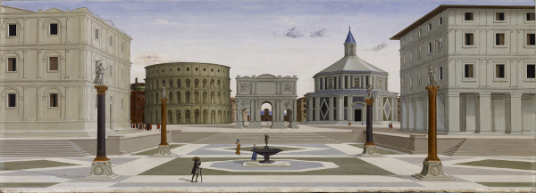
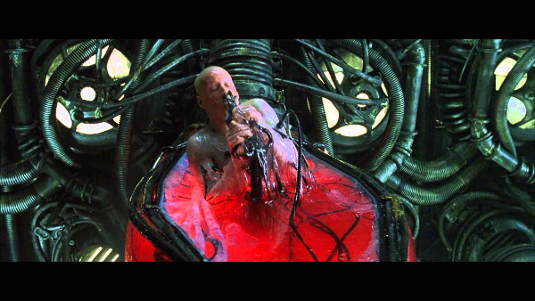

# Non-Plone development with Plone
## Éric Bréhault - PloneConf 2016

.fx: extra-large

--------------------------------------------------------------------------------

# A developer story - Episode 1

# Presenter Notes

At first look, Plone looks clean, organized. The ideal city!

.fx: extra-large

--------------------------------------------------------------------------------

# A developer story - Episode 2

# Presenter Notes

Now, you want to develop something by your own. Can you face the awful truth?

.fx: extra-large

--------------------------------------------------------------------------------

# A developer story - Episode 3

# Presenter Notes

Well, you will get a very though awakening

.fx: extra-large

--------------------------------------------------------------------------------

# A developer story - Episode 4

# Presenter Notes

If you are strong enough, at some point you will see the matrix. This guy is a Plone developer: he moves fluidly in a middle of a shit storm, he looks quiet and confident because he knows exactly which moves he has to take to face any given danger second by second.

.fx: extra-large

--------------------------------------------------------------------------------

# Not OK!

.fx: extra-large

--------------------------------------------------------------------------------

# A new audience

Webmasters

Frontend developers

# Presenter Notes

They should be able to walk free in the ideal city

.fx: extra-large

--------------------------------------------------------------------------------

# Why would they need a CMS?

That's sooooo 2010.

Let's use a REST API + a cool frontend framework!

# Presenter Notes

backend api / front pure js is good and trendy, why would I need a CMS as backend? in my last non-Plone project (tereval), it took 4 days to get a working breadcrumb

.fx: extra-large

--------------------------------------------------------------------------------

# Trust me, they need a CMS

.fx: extra-large

--------------------------------------------------------------------------------

# They know about web development...

... but not about Plone development.

.fx: extra-large

--------------------------------------------------------------------------------

# Plone should be their CMS

# Presenter Notes

I want Plone to be their CMS

.fx: extra-large

--------------------------------------------------------------------------------

# Should they learn Plone?

They know enough!

# Presenter Notes

Why should we need more knowledge than HTML and webmastering to do something with Plone?

.fx: extra-large

--------------------------------------------------------------------------------

# Tell them where to start

"There is a lot of documentation, but I find it in times too technical and not very suitable for beginners.

I would prefer more of the youtube tutorials or even documentation written in the style of Rapido.

It tells where to start, what steps to follow exactly and clearly."

# Presenter Notes

Here I am not criticizing the Plone documentation, which is very good. The problem is the whole Plone story here, which is too big.

We have just started such a work in training.plone.org

.fx: extra-large

--------------------------------------------------------------------------------

# Plone development for non-Plone developers

- Diazo
- Dexterity
- Rapido
- Mosaic

.fx: extra-large

--------------------------------------------------------------------------------

# They all work TTW

.fx: extra-large

--------------------------------------------------------------------------------

# They also work from the file system!

.fx: extra-large

--------------------------------------------------------------------------------

# They can be used by non-Plone developers

They allow to work on Plone "from the outside".

.fx: extra-large

--------------------------------------------------------------------------------

# Ok, but how far can we go?

.fx: extra-large

--------------------------------------------------------------------------------

# Use cases

[toulouse-labo.fr](http://toulouse-labo.fr/fr): discovering sciences by exploring an imaginary world.

[mysmartcab.fr](https://mysmartcab.fr): managing legal class actions.

.fx: extra-large

--------------------------------------------------------------------------------

# Built by non-Plone developers

.fx: extra-large

--------------------------------------------------------------------------------

# Why a CMS? Why Plone?

You get a **fantastic back-office** for free!

Let's turn it into a **versatile backend**.

# Presenter Notes

Good back-office because: good UI to manage content, super secured, easy to customize.

Ok, so Plone is useful even if you are not a Plone developer.
But most part of people do not want to write a browser view to get a json.
They feel more confident with npm script than buildout recipes.

.fx: extra-large

--------------------------------------------------------------------------------

# How they did it

- develop a frontend theme,
- create Dexterity types + workflow TTW,
- implement specific features with Rapido,
- use Diazo to mix all together.

.fx: extra-large

--------------------------------------------------------------------------------

# Complex features

- a registration wizard,
- a Paypal endpoint,
- a messaging system,
- a user-manageable form.

.fx: extra-large

--------------------------------------------------------------------------------

# Our practices

A regular NPM project.

A Plone buildout + theme egg.

An NPM script to push the build to the `static/front` folder.

.fx: extra-large

--------------------------------------------------------------------------------

# Our practices

The `static/front` folder is ignored in Git master but not in `prod` branch.

An NPM script makes a `merge --no-commit` + `npm build` and then push to prod server.

.fx: extra-large

--------------------------------------------------------------------------------

# We can do better, thanks to Asko!

.fx: extra-large

--------------------------------------------------------------------------------

# plonetheme.webpacktemplate

It allows to use Plone JS resources in our frontend project.

.fx: extra-large

--------------------------------------------------------------------------------

# collective.themesitesetup, the no-egg approach

- GS profiles
- DX models
- translations
- permissions

All in the theme!

.fx: extra-large

--------------------------------------------------------------------------------

# plonetheme-upload

NPM package to upload a theme to a Plone site from an NPM project.

.fx: extra-large

--------------------------------------------------------------------------------

# HELP US IMPROVE!

PLEASE USE THE

SURVEY APP TO SEND

US FEEDBACK.

ploneconf.sixfeetup.com

.fx: extra-large

--------------------------------------------------------------------------------

# Thank you!

.fx: extra-large

--------------------------------------------------------------------------------