# Gestion et maintenance d'un parc d'équipements industriels

--------------------------------------------------------------------------------

> La gestion de maintenance assistée par ordinateur est une méthode de gestion assistée d'un logiciel destiné aux services de maintenance d'une entreprise afin de l'aider dans ses activités.

<cite> — http://fr.wikipedia.org/wiki/GMAO</cite>

.fx: quoteslide

--------------------------------------------------------------------------------

# Introduction à la GMAO JOB

.fx: alternate

--------------------------------------------------------------------------------

# La GMAO JOB en quelques mots

* Référencer ses équipements en entrant dans le détail de leur architecture technique.
* Assurer le suivi et la maintenance de ces équipements.
* Piloter l'activité de maintenance via des tableaux de bords.
* Accessible en mode web 24h/24 depuis n'importe quel PC, tablette ou smartphone équipé d'un navigateur Google Chrome ou Firefox de dernière génération.
* Interconnexion avec les applications du SI.
* Utilisée par tous les services de l'entreprise : responsables d’opération et administratif, commerciaux, techniciens.
* Mais aussi par les clients et partenaires.
* Accès sécurisé : identifiant/mot de passe, HTTPS, LDAP.

--------------------------------------------------------------------------------

# Une GMAO développée pour la société ALMA Services

.fx: alternate

--------------------------------------------------------------------------------

# La société ALMA Services > Le métier

* Société positionnée dans le secteur des équipements, installations et services pour la distribution des produits pétroliers en aval des raffineries.
* Maintenance des camions citernes et dépôts pétroliers.
* 10 établissements répartis sur le territoire français, 90 personnes.

--------------------------------------------------------------------------------

# La société ALMA Services > Le besoin initial

* Automatiser son processus métier de gestion des interventions sur son parc d'équipements.
* Modéliser dans le détail l'architecture techniques de ses équipements.
* Assurer la traçabilité de toutes les interventions techniques.
* Impliquer tous les services de la société.
* Offrir à ses clients un accès sécurisé à leurs données.
* Produire des tableaux de bord et bilans pour suivi et piloter l'activité.
* Connecter l'outil aux autres applications du SI : gestion clients, gestion des stocks, facturation, planification, ...
* Une application web accessible 24h/24 en mobilité, réactive, ergonomique et évolutive.

# Presenter Notes

* Cycle de vie d'une intervention : revue de contrat, préparation et planification de la mission, exécution de la mission par le technicien, clôture administrative et financière.
* Services impliqués : techniciens, responsables d’opération et administratifs, partenaires, clients, commerciaux, ...
* Mobilité : tablette, PC tactiles équipés de connexion 3G

--------------------------------------------------------------------------------

# La société ALMA Services > Les contraintes

*   Importance de l'ergomie, notamment pour la saisie des rapports d'intervention par des techniciens non habitués à l'outil informatique.
*   Récupération de l'historique des données des anciennes GMAO de la société (constitution technique et historique des interventions) :
    * Une GMAO dépôts écrite en PHP
    * 7 GMAO "quasi" identiques écrites en Access

# Presenter Notes

* Historique : assurer une continuité dans la traçabilité de toutes les interventions réalisées depuis les 10 dernières années

--------------------------------------------------------------------------------

# Un développement utilisant uniquement des outils et logiciels libres

.fx: alternate

--------------------------------------------------------------------------------

# Quels avantages par rapports aux logiciels propriétaires existants ?

*   Pas de coût d'acquisition de licence mais coût de développement initial.
*   Une indépendance totale vis à vis de l'éditeur/prestataire
    * Accès au code source
    * Changer de prestataire si nécessaire
    * L'internalisation du développement des évolutions et de la maintenance est possible
* Des communautés d'utilisateurs et de développeurs apportent leur aide et assurent la perrenité des outils utilisés.
*   Et peut-être le principal : permet d'adapter la solutions aux besoins du client !

## Adapter le logiciel à ses besoins, et non pas adapter ses besoins au logiciel.

# Presenter Notes

* Il existe des outils spécialisés au métier d'ALMA Services mais aucun ne répondait intégralement au besoin et étaient rétissant à s'adapter aux besoins d'ALMA.
* Coût d'acquisition : peut être la contrainte la moins importante
* Accès au code source : pouvoir vérifier la qualité de l'application. Le logiciel n'est pas une boîte noire.
* Internaliser les développement : on trouve de plus en plus facilement des formations pour développeurs
* Communautés : Ex en cas de bug : Ayant accès au code source des briques utilisées ils nous est possible d’investiguer, de résoudre le problème ou de le reporter efficacement pour aider d’autres développeurs à le corriger. Nous avons eu le cas avec un bug de fonctionnement des menus Twitter Bootstrap sur les tablettes Androïd.

* Les outils de développement Open Source ont permis de répondre à l’intégralité des besoins, du développement du logiciel jusqu’à sa mise en production et son hébergement.

--------------------------------------------------------------------------------

# Des outils de développement Open Source de plus en plus utilisés

* Il existe des outils Open Source permettant de répondre à quasiment tous les besoins : de la conception du logiciel à sa mise en production et son hébergement.
* Des projets d'envergure les adoptent. Exemples pour le framework Django :

mais aussi : La Nasa, le Washington Times, Google App Engine, ...

--------------------------------------------------------------------------------

# GMAO, les principales fonctionnalités

.fx: alternate

--------------------------------------------------------------------------------

# GMAO > Connexion sécurisée à l'application

Écran de connexion

.fx: gmao_image

--------------------------------------------------------------------------------

# GMAO > Tableau de bord métier : piloter l'activité

Vue d'ensemble des interventions et des missions ; alertes sur les équipements et les contrats.

Tableau de bord

.fx: gmao_image

# Presenter Notes

* Interventions : en cours, planifiées, en préparation, clôturées
* Le tableau bord est personnalisé en fonction du profil. Un technicien y retourve son planning et la liste des rapports d'intervention qu'il doit remplir.

--------------------------------------------------------------------------------

# GMAO > Tableau de bord métier : piloter l'activité

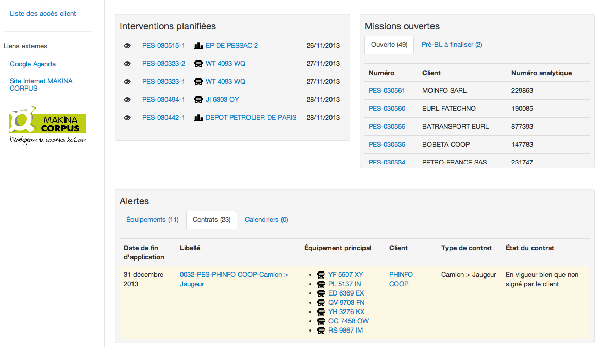

Suite du tableau de bord

.fx: gmao_image

--------------------------------------------------------------------------------

# GMAO > Constitution technique des équipements

Décrire finement les équipements faisant l'objet d'interventions de maintenance (ex : camion, dépôt pétrolier, station service).

Fiche d'un camion citerne

.fx: gmao_image

--------------------------------------------------------------------------------

# GMAO > Constitution technique des équipements

L'application est conçue de manière à ce qu'il soit possible de développer de nouveaux types d'équipements (ex : éolienne, pipeline, station de mesure, téléphérique, ascenseur, ...).

Fiche d'un dépôt pétrolier

.fx: gmao_image

--------------------------------------------------------------------------------

# GMAO > Les clients

La base de données Clients est synchronisée sur la base de données fournie par votre ERP/CRM (ex : Ciel Quantum, Sage, ERP maison, SugarCRM...).

Fiche client

.fx: gmao_image

--------------------------------------------------------------------------------

# GMAO > Les clients

L'application de gestion des interventions permet d'enrichir cette base de données avec des informations utiles pour les interventions de maintenance (adresses, instruction particulières, documentation, ...).

Suite de la fiche client

.fx: gmao_image

--------------------------------------------------------------------------------

# GMAO > Les contrats

Les contrats sont en lien avec les clients, les équipements et les interventions. Ils alimentent des alertes (ex : contrat arrivant à échéance) et des bilans graphiques.

Gestion de contrat

.fx: gmao_image

--------------------------------------------------------------------------------

# GMAO > Organisation mono ou multi-agences

Organisation des responsables et des techniciens par agence.

Liste des agences

.fx: gmao_image

--------------------------------------------------------------------------------

# GMAO > Organisation mono ou multi-agences

Tableau de bord, planning et bilans par agence.

Détail d'une fiche agence

.fx: gmao_image

--------------------------------------------------------------------------------

# GMAO > Les intervenants

Liste des intervenants (nom, rattachement à une agence ou non, coordonnées...) réalisant les opérations de maintenance.

Liste des intervenants

.fx: gmao_image

--------------------------------------------------------------------------------

# GMAO > Les intervenants

Les intervenants sont responsables de saisir leurs rapports d'intervention dans l'outil.

Détail d'une fiche intervenant

.fx: gmao_image

--------------------------------------------------------------------------------

# GMAO > Les pièces détachées

Le module « Articles » permet de gérer toute la base de données des articles (pièces détachées) sur la base des informations fournies par votre ERP.

Détail d'une fiche article

.fx: gmao_image

--------------------------------------------------------------------------------

# GMAO > Les stocks de pièces détachées

Le module « Stocks » permet de visualiser le contenu des stocks sur la base des informations fournies par votre ERP.

Consultation des stocks de pièces détachées

.fx: gmao_image img_w75percent

--------------------------------------------------------------------------------

# GMAO > Aide à la feuille de temps

Outil d'aide offrant aux intervenants le suivi des heures réalisées en intervention.

Consulter ses heures réalisées en intervention

.fx: gmao_image

# Presenter Notes

Cela peut aider par exemple à la saisie des feuilles de temps par les employés.

--------------------------------------------------------------------------------

# GMAO > Aide à la planification

Outil permettant de planifier en avance des interventions récurrentes sur des équipements.

Planifications d'interventions récurrentes

.fx: gmao_image img_w85percent

# Presenter Notes

* Plus qu'une aide à la saisie, ce module permet de préparer en avance son planning avec toutes les interventions à venir connues.

* Des alertes informent en temps voulu les planificateurs de la nécessité de planifier une intervention.

--------------------------------------------------------------------------------

# GMAO > Aide à la planification

Planification d'une intervention et choix de la date pour la prochaine occurrence.

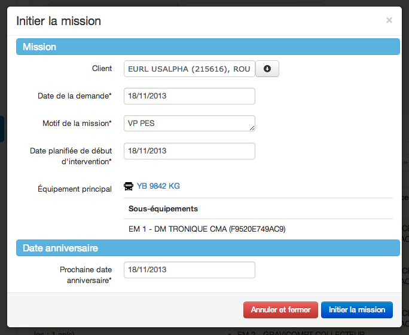

Planification d'une intervention récurrente

.fx: gmao_image img_w75percent

--------------------------------------------------------------------------------

# GMAO > Planning

Le planning permet de suivre les interventions par agence ou par équipe et par intervenant.

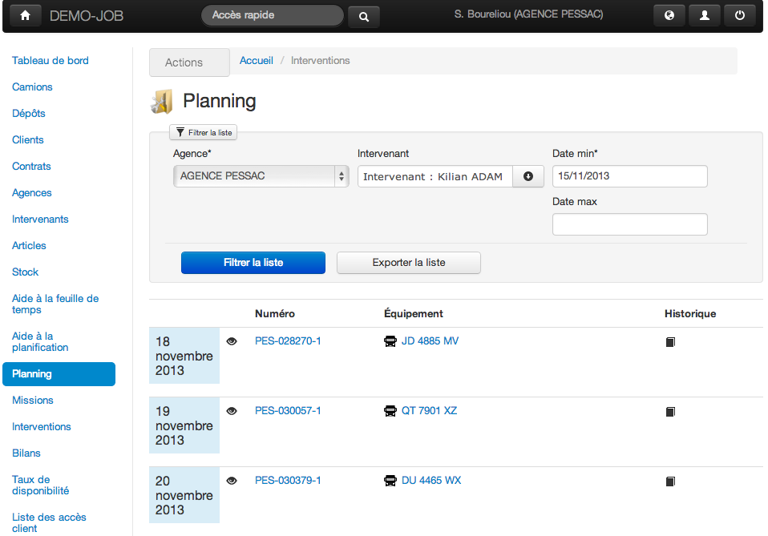

Interventions planifiées à venir

.fx: gmao_image img_w90percent

--------------------------------------------------------------------------------

# GMAO > Planning

Consultation du résumé d'une ntervention à venir

.fx: gmao_image img_w95percent

--------------------------------------------------------------------------------

# GMAO > Planning

Le planning des intervenants est synchronisable avec Google Agenda.

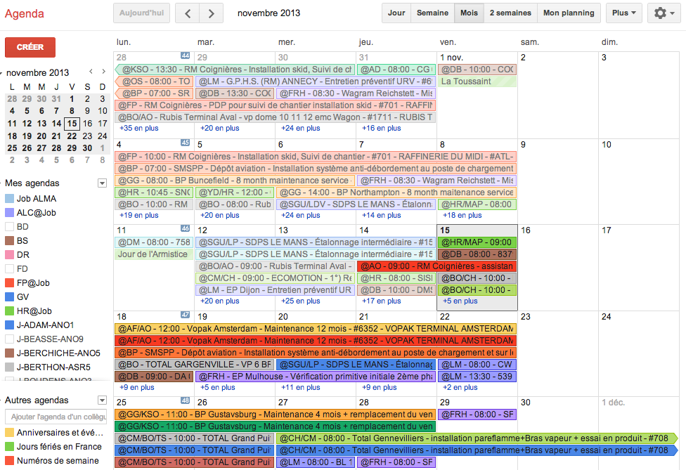

Google Agenda

.fx: gmao_image img_w90percent

# Presenter Notes

* Agenda comprenant un calendrier par intervenant.
* Cela offre une solution simple pour partager facilement des calendriers, et permet d' y accéder depuis son smartphone.

--------------------------------------------------------------------------------

# GMAO > Le rapport d'intervention

Automatisation complète du processus métier de gestion d'une intervention : de la revue de contrat jusqu'à l'envoi du rapport PDF au client ainsi qu'un document de pré-facturation à l'ERP.

Rapport d'intervention : iniation de la mission et revue de contrat

.fx: gmao_image img_w65percent

# Presenter Notes

* Les interventions de maintenance sont réalisées par les intervenants sur les équipements.
* Les étapes du cycle de vie sont organisées ainsi : Initiation mission, Revue de contrat, Préparation intervention, Exécution intervention (rapport de l'intervenant en mobilité), Clôture intervention, Intervention clôturée et mission pré-facturée.

--------------------------------------------------------------------------------

# GMAO > Le rapport d'intervention

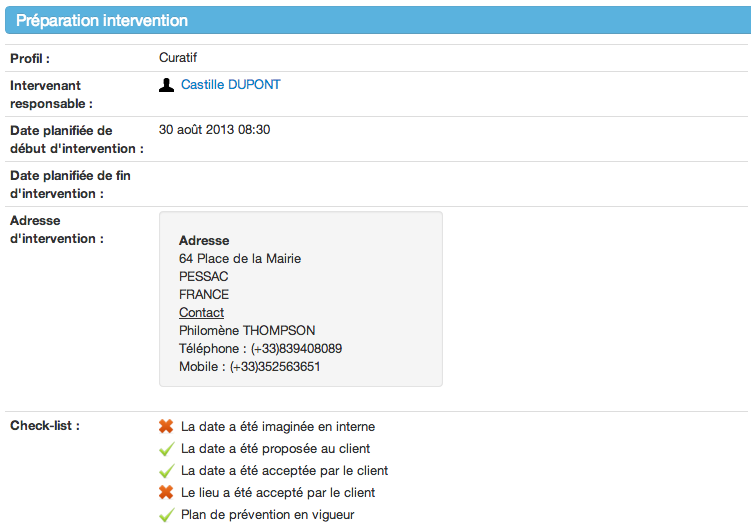

Rapport d'intervention : prépration et planification de l'intervention

.fx: gmao_image img_w95percent

--------------------------------------------------------------------------------

# GMAO > Le rapport d'intervention

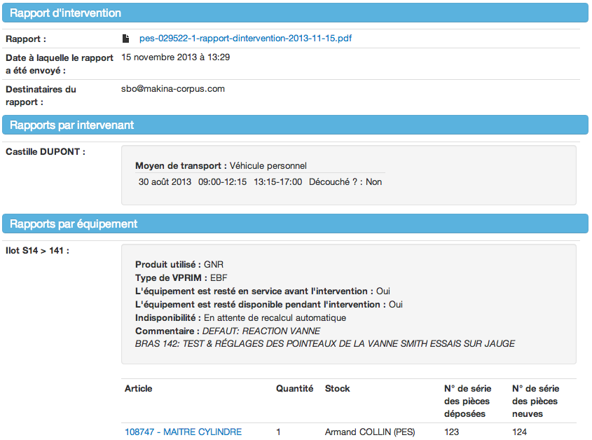

Rapport d'intervention : rapport du technicien

.fx: gmao_image img_w90percent

# Presenter Notes

* Il y a également un module activant la géolocalisation du lieu au moment de l'envoi du rapport PDF au client.

--------------------------------------------------------------------------------

# GMAO > Préparation de facture

Préparation de facture imprimable en PDF : rappel de la mission, du client, des temps passés, des déplacements et articles consommées. Envoi à l'ERP pour facturation.

Préparation de facture

.fx: gmao_image img_w75percent

--------------------------------------------------------------------------------

# GMAO > Bilans et statistiques

De nombreux graphiques, statistiques, bilans peuvent être générés.

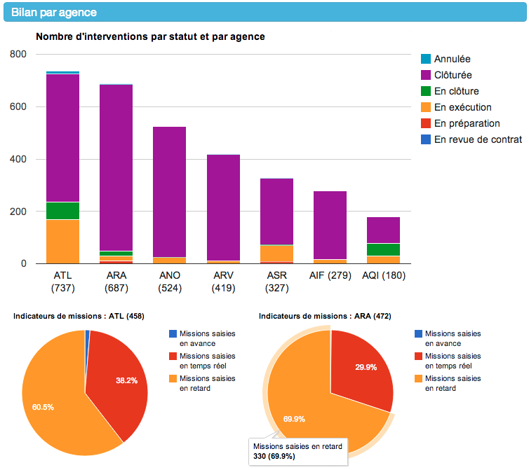

Bilans et indicateurs par agences

.fx: gmao_image img_w70percent

--------------------------------------------------------------------------------

# GMAO > Bilans et statistiques

Bilans par profil d'intervention

.fx: gmao_image

--------------------------------------------------------------------------------

# GMAO > Bilans et statistiques

Bilans par mois et par profil d'intervention ; Importance du curatif

.fx: gmao_image img_w75percent

--------------------------------------------------------------------------------

# GMAO > Bilans et statistiques

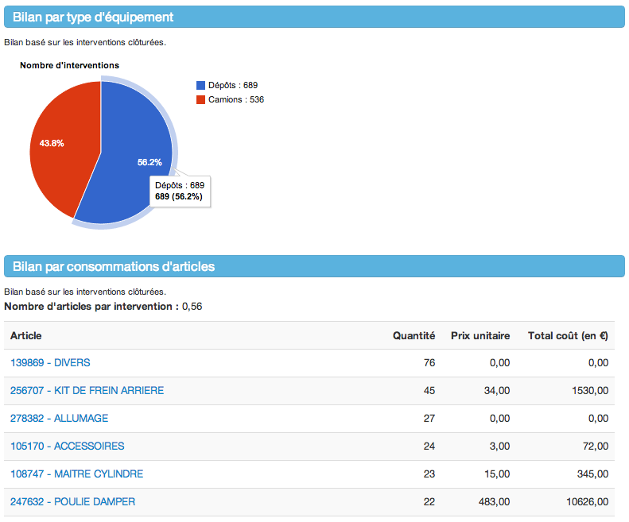

Bilans par type d'équipement ; Consommation d'articles

.fx: gmao_image img_w80percent

--------------------------------------------------------------------------------

# GMAO > Bilans et statistiques

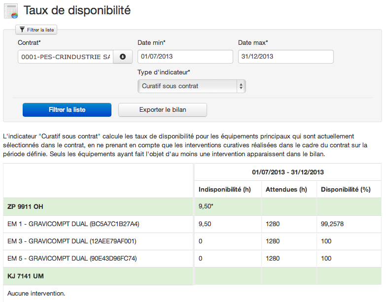

Taux de disponibilité

.fx: gmao_image img_w85percent

--------------------------------------------------------------------------------

# GMAO > Bilans et statistiques

Carte des équipements et des agences

.fx: gmao_image img_w85percent

--------------------------------------------------------------------------------

# GMAO > Accès clients

Donner accès à ses clients à la constitution technique de leurs équipements et à l'historique des interventions de maintenance associées.

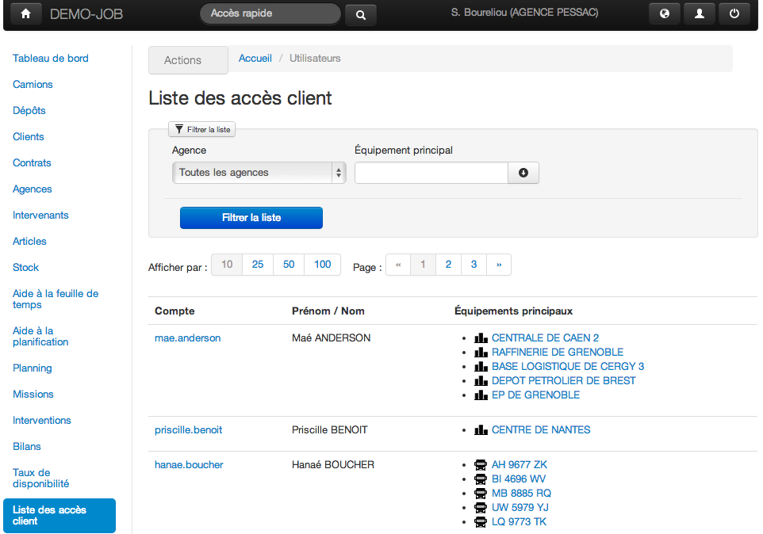

Liste des accès clients

.fx: gmao_image img_w85percent

--------------------------------------------------------------------------------

# GMAO > Accès clients

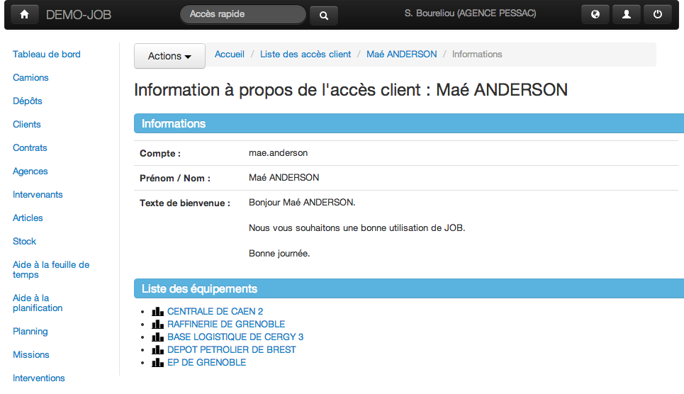

Détail d'un accès client

.fx: gmao_image

# Presenter Notes

* On peut également avoir une photo d'accueil personnalisée.

--------------------------------------------------------------------------------

# GMAO > Utilisation en mobilité

L’application peut être utilisée dans le navigateur d'un smartphone ou d'une tablette connectée à Internet.

Utilisation depuis une tablette

.fx: gmao_image img_w80percent

--------------------------------------------------------------------------------

# GMAO > Utilisation en mobilité

Utilisation depuis une smartphone

.fx: gmao_image img_w90percent

--------------------------------------------------------------------------------

# Merci !

