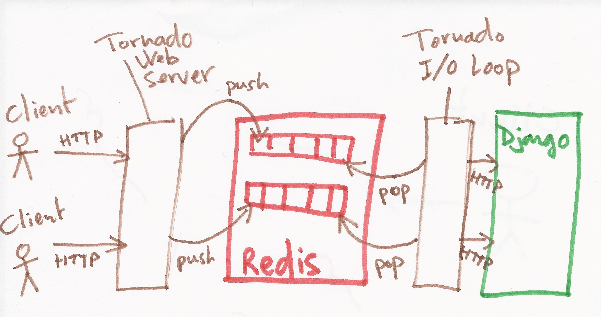

# Démystifier les entrées/sorties asynchrones

La programmation basée sur les entrées/sorties asynchrones en Python : cas
d'utilisations, fonctionnement interne, contraintes et styles de programmation.

---

# CPU-bound

Temps d'exécution limité par le processeur.

Calculs bruts, encodage de données, etc.

**↪ l'asynchrone ne sert à rien**

Pour aller plus vite :

 * optimiser les algorithmes
 * rajouter des processus

---

# I/O bound

Temps d'exécution limité par les entrées/sorties

 * requêtes base de données
 * services REST externes
 * fork de processus externes
 * accès au système de fichiers

**↪ l'asynchrone peut être utile**

---

# Nombreux clients connectés

WebSockets **→ l'asynchrone est vite indispensable**

---

# L'asynchrone peut-il nous aider ?

Nos processus passent leur temps à attendre ? Plus assez d'espace (mémoire) pour en ajouter d'autres ?

**↪ Les passer en asynchrone peut aider.**

Nos processus travaillent ?

**↪ Les passer en asynchrone ne va pas aider.**

On peut par contre envisager d'externaliser ce travail pour les passer en asynchrone.

---

# Tornado

    !python
    import tornado.ioloop
    import tornado.web

    class MainHandler(tornado.web.RequestHandler):
        def get(self):
            self.write("Hello, world")

    application = tornado.web.Application([
        (r"/", MainHandler),
    ])

    if __name__ == "__main__":
        application.listen(8888)
        tornado.ioloop.IOLoop.instance().start()

10 000 requêtes par lots de 100 :

    !console
    $ ab -n 10000 -c 100 http://127.0.0.1:8888/
    Time taken for tests:   6.706 seconds
    Complete requests:      10000
    Requests per second:    1491.25 [#/sec] (mean)
    Time per request:       67.058 [ms] (mean)

---

# Tornado avec SQL bloquant

    !python
    class MainHandler(tornado.web.RequestHandler):
        def get(self):
            cur = self.application.db.cursor()
            cur.execute("SELECT 42, pg_sleep(0.300);")
            result = cur.fetchone()
            self.write("Result: %s" % result[0])

20 requêtes par lots de 10 :

    !console
    $ ab -n 20 -c 10 http://127.0.0.1:8888/ 
    Time taken for tests:   6.201 seconds
    Complete requests:      20
    Requests per second:    3.23 [#/sec] (mean)
    Time per request:       3100.513 [ms] (mean)

---

# Tornado avec SQL asynchrone

    !python
    from tornado import web, ioloop
    import momoko

    class MainHandler(tornado.web.RequestHandler):

        @tornado.web.asynchronous
        def get(self):
            # Ancienne API de Momoko
            self.application.db.execute(
                'SELECT 42, pg_sleep(0.300)', callback=self._done)

        def _done(self, cursor, error):
            result = cursor.fetchone()
            self.write("Result: %s" % result[0])
            self.finish()

20 requêtes par lots de 10 :

    !console
    $ ab -n 20 -c 10 http://127.0.0.1:8888/
    Time taken for tests:   0.622 seconds
    Complete requests:      20
    Requests per second:    32.18 [#/sec] (mean)
    Time per request:       310.756 [ms] (mean)

---

# Structure d'une IO loop

Version extrêmement simplifiée de l'IOLoop de Tornado :

    !python
    def start(self):
        while True:
            # Appelle la fonction de polling de la plateforme
            # (epoll sous Linux, kqueue sous BSD). Celle-ci 
            # renvoie les événements survenus sur les
            # descripteurs de fichiers (sockets, etc.) surveillés
            event_pairs = self._impl.poll(poll_timeout)
            self._events.update(event_pairs)
            while self._events:
                # Appelle les handler d'événements enregistrés
                fd, events = self._events.popitem()
                fd_obj, handler_func = self._handlers[fd]
                handler_func(fd_obj, events)

Enregistrement des handlers :

    !python
    def add_handler(self, fd, handler, events):
        fd, obj = self.split_fd(fd)
        self._handlers[fd] = (obj, stack_context.wrap(handler))
        self._impl.register(fd, events | self.ERROR)

---

# Callbacks

    !python
    class MainHandler(tornado.web.RequestHandler):

        @tornado.web.asynchronous
        def get(self):

            def handle_db(cursor, error):
                db_value = cursor.fetchone()[0]

                def handle_http(response):
                    json_data = json.loads(response.body.decode())
                    result = db_value - json_data['value']
                    self.write("Result: %s" % result)
                    self.finish()

                http_client = tornado.httpclient.AsyncHTTPClient()
                http_client.fetch('http://127.0.0.1:8000/', handle_http)

            # Ancienne API de Momoko
            self.application.db.execute(
                'SELECT 42, pg_sleep(0.300)', callback=handle_db)

---

# Callbacks : mesure

20 requêtes par lots de 10 :

    !console
    $ ab -c 10 -n 20 http://127.0.0.1:8888/
    Time taken for tests:   1.260 seconds
    Requests per second:    15.88 [#/sec] (mean)
    Time per request:       629.834 [ms] (mean)

---

# Coroutines

    !python
    class MainHandler(tornado.web.RequestHandler):

        @tornado.gen.coroutine
        def get(self):
            cursor = yield self.application.db.execute(
                'SELECT 42, pg_sleep(0.300)')
            db_value = cursor.fetchone()[0]
            http_client = tornado.httpclient.AsyncHTTPClient()
            response = yield http_client.fetch('http://127.0.0.1:8000/')
            json_data = json.loads(response.body.decode())
            result = db_value - json_data['value']
            self.write("Result: %s" % result)
            self.finish()

20 requêtes par lots de 10 :

    !console
    $ ab -c 10 -n 20 http://127.0.0.1:8888/
    Time taken for tests:   1.281 seconds
    Requests per second:    15.61 [#/sec] (mean)
    Time per request:       640.527 [ms] (mean)

---

# Parallélisme

    !python
    class MainHandler(tornado.web.RequestHandler):

        @tornado.gen.coroutine
        def get(self):
            http_client = tornado.httpclient.AsyncHTTPClient()
            # Lancement des requêtes en parallèle
            cursor, response = yield [
                self.application.db.execute('SELECT 42, pg_sleep(0.300)'),
                http_client.fetch('http://127.0.0.1:8000/'),
            ]
            db_value = cursor.fetchone()[0]
            json_data = json.loads(response.body.decode())
            result = db_value - json_data['value']
            self.write("Result: %s" % result)
            self.finish()

20 requêtes par lots de 10 :

    !console
    $ ab -c 10 -n 20 http://127.0.0.1:8888/
    Time taken for tests:   0.663 seconds
    Requests per second:    30.15 [#/sec] (mean)
    Time per request:       331.638 [ms] (mean)

---

# Depuis Python 3.5 : async/await

    !py3
    # Nécessite tornado==4.3.dev1
    class MainHandler(tornado.web.RequestHandler):

        async def get(self):
            http_client = tornado.httpclient.AsyncHTTPClient()
            cursor, response = await tornado.gen.multi([
                self.application.db.execute('SELECT 42, pg_sleep(0.300)'),
                http_client.fetch('http://127.0.0.1:8000/')
            ])
            db_value = cursor.fetchone()[0]
            json_data = json.loads(response.body.decode())
            result = db_value - json_data['value']
            self.write("Result: %s" % result)
            self.finish()

20 requêtes par lots de 10 :

    !console
    $ ab -c 10 -n 20 http://127.0.0.1:8888/
    Time taken for tests:   0.706 seconds
    Requests per second:    28.35 [#/sec] (mean)
    Time per request:       352.756 [ms] (mean)

---

# Exemple d'utilisation : [THR](http://thr.readthedocs.org/)

 * Tornado HTTP Router
 * Tornado HTTP over Redis
 * Toulouse HTTP Router

---

# THR - Contexte

* connections simultanées à la prise de poste des prévisionistes
* traitements de certaines requêtes assez lourd
* application web *classique* en Django donc pas asynchrone

---

# THR - Besoins

* lissage des *bursts* avec files d'attente transparentes pour le client
* quotas avec régulation transparente
* gestion de priorités des requêtes HTTP
* authentification / autorisation via appel à service externes

**↪ THR utilise Tornado pour protéger et réguler une appli Django par des mécanismes asynchrones**

## Presenter Notes
50 à 100 personnes prennent leur service en même temps et bombardent le système de requêtes
THR utilise Tornado pour protéger et réguler un cluster django synchrone (CPU bound) par des mécanismes asynchrones tout en continuant de répondre de façon synchrone aux requêtes HTTP des clients.

---

# THR - Schema

* http2redis pose des requêtes sur de files d'attente Redis
* redis2http dépile les requêtes et les passe à Django

---

# THR - Exemple

Exemple : limiter le nombre de requêtes simultanées comportant un entête HTTP donné

    !py
    def limit_foo(request):
        return request.headers.get('Foo') or 'none'

    add_max_limit('limit_foo_header', limit_foo, "bar", 2)

Requêtes ne correspondant pas au critère de limitation :

    !console
    $ ab -c10 -n10 -H "Foo: baz" http://127.0.0.1:8888/|grep 'Time taken'
    Time taken for tests:   1.045 seconds

Requêtes correspondant au critère :

    !console
    $ ab -c10 -n10 -H "Foo: bar" http://127.0.0.1:8888/|grep 'Time taken'
    Time taken for tests:   5.055 seconds

Note : le service sous-jacent met une seconde à répondre dans les deux cas.

---

# Exemple d'utilisation : [Circus](http://circus.readthedocs.org/)

## Contexte

Des dizaines de processus assimilant des données d'origines diverses : satellites, radars, observations, super-calculateurs...

* une centaine de processus
* 10 fichiers / seconde en moyenne
* 300 Go quotidien 

## Contrainte

Arrêter et expirer les processus sans interrompre le travail en cours.

## Presenter Notes
L'intérêt de Tornado pour circus est l'utilisation des coroutines qui permet de sortir du "callback hell" dans lequel j'étais tombé à ma première tentative. Le code est bien plus lisible et bien moins bugué !

---

# Circus

* gestionnaire de processus en Python
* se base sur la boucle d'entrée/sortie de Tornado pour manipuler les processus de manière non-bloquante (contribution de [Fabien Marty](https://blog.mozilla.org/services/2013/11/05/circus-0-10-released/))

Extrait du code :

    !py
    @gen.coroutine
    def _stop_watchers(self, close_output_streams=False,
                       for_shutdown=False):
        watchers = watcher_iter_func(reverse=False)
        yield [
            watcher._stop(close_output_streams, for_shutdown)
            for watcher in watchers
        ]

Note : ici l'asynchrone est utilisé comme une alternative aux threads. 

---

# En conclusion

Quand utiliser de l'asynchrone ?

  1. traitement des requêtes ralenti par l'accès à des ressources externes : base de données, service externe, etc.
  2. connexion persistante avec le navigateur
  3. pas assez de mémoire pour simplement rajouter des processus ou des threads
  4. on veut éviter les threads et les mécanismes d'exclusion mutuelle qui vont avec

---

# En conclusion

Comment coder en asynchrone ?

  * utiliser une bibliothèque : Tornado, asyncio ou Twisted
  * callbacks
  * coroutines
    * generators
    * async/await
