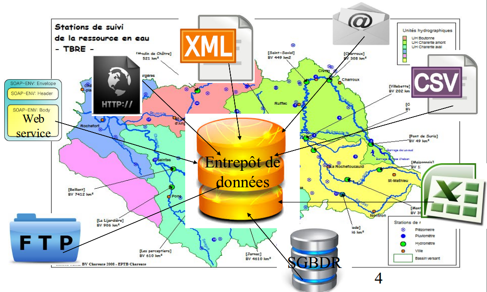
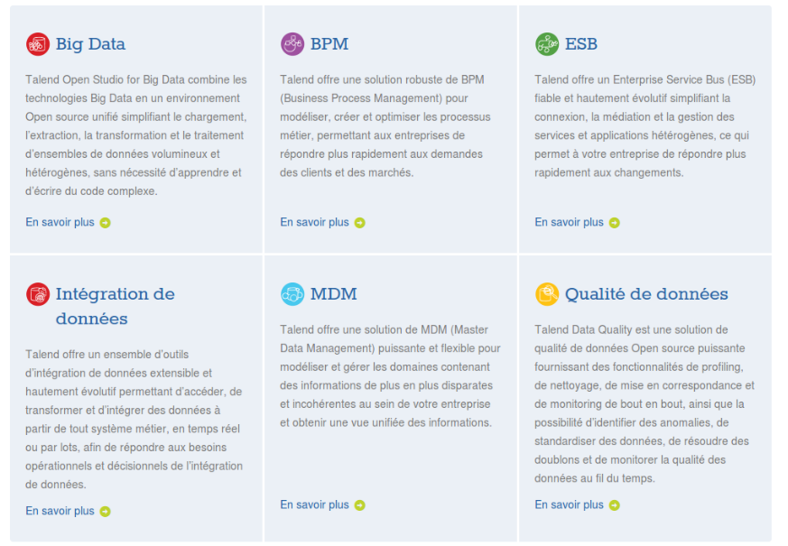
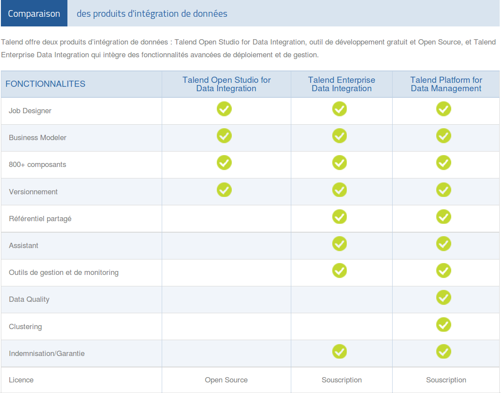
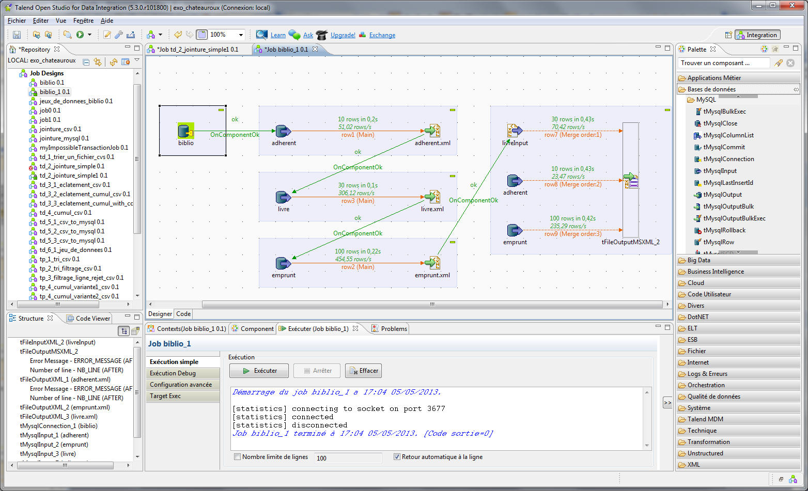

# Présentation de Talend Open Studio for Data Integration

--------------------------------------------------------------------------------

# Gaël PEGLIASCO

* twitter: @gpegliasco
* email: gael.pegliasco@makina-corpus.com
* Chef de projets, formateur, développeur Python et Talend

--------------------------------------------------------------------------------

# A QUOI SERT UN ETL ?

.fx: alternate

--------------------------------------------------------------------------------

# Qu'est-ce qu'un ETL ?

# ETL : Extract, Transform, Load
* C’est une technologie middleware permettant de lire, transformer et sauvegarder des données

# Recouvre à la fois :
* Le processus d’alimentation en données
* Les outils permettant de mettre en œuvre ce processus

# Utilisé principalement dans les domaines :
* De la synchronisation/migration de données 
* De la consolidation de données (datawarehouse) 
* De la Business Intelligence (BI)

--------------------------------------------------------------------------------

# Un projet réel
* Entrepôt de données à sources multiples

--------------------------------------------------------------------------------

# Multiples sources et hétérogénéité des données

## Données fournies sous de multiples formes et par de multiples fournisseurs
* <strong>Fournisseurs</strong>  : Méteo France, Station de pompage, station de relevage, SAUR, Conseil général, ...
* <strong>Protocoles</strong> : SMTP, HTTP, FTP, SOAP, SGBDR
* <strong>Formats</strong> : CSV, Excel, Texte Brut, XML, …
* <strong>Unités</strong> : litres/heure, M3/sec, Kilo, Méga, ...

--------------------------------------------------------------------------------

# Difficultés de mise en œuvre

# Développement « à la mano » en langage Python
# Implémentation de tous les protocoles et traitements de bas niveau
* Plusieurs milliers de lignes de codes
* Maintenance difficile, impliquant connaissance des données, du langage, des formats, des protocoles
# Temps de réalisation  : 12 mois homme avec Python
 
## <b>Ré-écriture complète avec Talend : 3 mois</b>

--------------------------------------------------------------------------------

# Présentation de Talend Open Studio (TOS)

.fx: alternate

--------------------------------------------------------------------------------

# Suite Talend Open Studio

--------------------------------------------------------------------------------

# Présentation de Talend Data Integration

# Talend Data Integration est un ETL de la société Talend
  * C’est un projet open source
    *  Version gratuite : Talend Open Studio (TOS)
    * Versions payantes : Monitoring, ordonnanceur, …
  * C’est une application « Eclipse plateform »
    * Première version en 2005
# C’est un ETL générateur de code (Java, initialement Perl )
  * Création d’un jar à exécuter

--------------------------------------------------------------------------------

# Les différentes versions Talend Data Integration

--------------------------------------------------------------------------------

# TOS : produits concurrents

# Open Source
  * Pentaho Data Integration (ex Kettle)
  * CloverETL
  * Scriptella ETL 
  * Apatar
# Propriétaires
  * IBM InfoSphere DataStage
  * Oracle Data Integrator
  * SQL Server Integration Services (Microsoft) 
  * Oxio Data Intelligence solution

--------------------------------------------------------------------------------

# Démonstration

--------------------------------------------------------------------------------

# Merci !

## Si vous avez des questions ?

--------------------------------------------------------------------------------

# Un petit café pour terminer ?

## Et même un grand...

